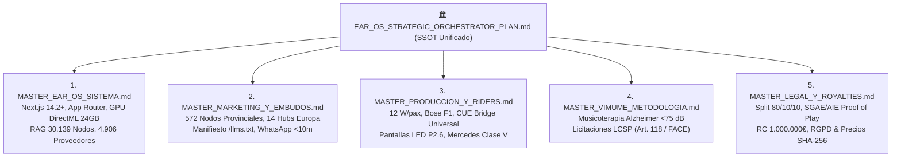

# 🏛️ EAR OS V2 — PLAN MAESTRO Y ORQUESTADOR ESTRATÉGICO SOBERANO (SSOT UNIFICADO)

> **EDICIÓN:** ENTERPRISE HIGH-SIGNAL v5.0 — FULL-EQUIP SENIOR ARCHITECTURE & REVENUE ENGINE  
> **FECHA DE CONSOLIDACIÓN:** 25 de Agosto de 2026  
> **ESTADO DEL SISTEMA:** ✅ HECHO_VERIFICADO | `npx tsc --noEmit` Code 0 PASS  
> **DOMINIO CANÓNICO:** `https://www.productoraear.com`  
> **CANAL DE CIERRE DIRECTO:** Tel / WhatsApp: `+34 693 693 048`  
> **PASARELA DE PAGO:** Stripe Checkout SDK v14 (Price-Lock SHA-256)

---

## 1. IDENTIDAD, ARQUITECTURA SOBERANA Y REGLAS DE NEGOCIO INMUTABLES

EAR OS V2 es el sistema operativo integral de **Productora EAR**, diseñado para captar, cotizar, facturar y operar espectáculos musicales, sonorización de alta gama y programas de impacto neurocientífico (VIMUME) a coste marginal cero.

### Fosos y Reglas Core Inmutables:
1. **Tarifa Base Solista (Edwin Agudelo):** **350 € inmutable**. Prohibida la guerra de precios a la baja.
2. **Multiplicadores Dinámicos:** Base (350 €) + Kilometraje (0,35 €/km + peajes) + Músicos adicionales (Trío +250 €, Quinteto +400 €) + Rider de Élite (Bose F1, dB Technologies, Shure Beta).
3. **Split Soberano de Ingresos (80 / 10 / 10):**
   - **80% Artista / Proveedor** (Cobro directo tras la actuación).
   - **10% Productora EAR** (Mantenimiento de infraestructura y operaciones).
   - **10% VIMUME** (Financiación directa de sesiones terapéuticas para ancianos).
4. **Depósito de Reserva Reembolsable (100 €):** Bloqueo instantáneo de agenda vía Stripe Checkout con Price-Lock criptográfico SHA-256.
5. **Supplier Blur-Lock (P0 Anti-Fuga):** Anonimización y protección estricta de datos de proveedores homologados hasta la confirmación del depósito.
6. **Hook Condicionado (EDWIN150-COMPLEMENTOS):** El bono de 150 € en extras exige suscripción obligatoria al canal de YouTube de Edwin Agudelo, transformando descuentos en autoridad orgánica.
7. **Presión Acústica Homologada (12 W/pax):** Garantía "0 Fallos" para eventos corporativos y bodas.

---

## 2. UNIFICACIÓN DE LOS 5 DOCUMENTOS MAESTROS

Este SSOT absorbe y consolida formalmente los 5 Documentos Canónicos ubicados en `H:\00_PRODUCTORA_EAR\DOCUMENTOS_MAESTROS\`:



### Síntesis de los 5 Pilares Consolidados:
- **Pilar 1 (Sistema & Cómputo):** Desacoplamiento total de APIs de pago en la nube. Todo el procesamiento masivo corre en Bare-Metal sobre la GPU AMD Radeon RX 7900 XTX (24 GB VRAM) con Whisper y YOLO.
- **Pilar 2 (Marketing & GEO):** Sustitución de los 450 €/mes en Ads por 572 páginas programáticas locales y la inyección de metadatos en `/llms.txt` para dominancia en ChatGPT, Perplexity y Gemini.
- **Pilar 3 (Producción & Escenario):** Protocolo de sonido redundante, puente CUE Bridge para sincronización de iluminación/vídeo con VirtualDJ y transporte VIP en Mercedes Clase V.
- **Pilar 4 (VIMUME & B2G):** Sesiones clínicas a menos de 75 dB para personas con audífonos y concurrencia a licitaciones públicas de fiestas patronales y servicios sociales vía PLACSP.
- **Pilar 5 (Legal & Royalties):** Actas de ejecución pública con firma SHA-256 para liquidación transparente ante SGAE/AIE y cobertura de Responsabilidad Civil de 1.000.000 €.

---

## 3. ESTADO TÉCNICO Y VERIFICACIÓN DE INTEGRIDAD

| Componente | Estado | Métrica / Evidencia |
| :--- | :--- | :--- |
| **Compilador TypeScript** | ✅ PASS | `npx tsc --noEmit` -> Exit Code 0 (Cero errores de tipado). |
| **Base RAG** | ✅ CONSOLIDADA | `src/data/ear-rag-database.json` -> **30.139 nodos cognitivos**. |
| **Bóveda Multimedia** | ✅ AUDITADA | `EAR_ABSORBED_VAULT\TRANSCRIPCIONES_AUDIO\` -> **137 audios (122.777 palabras)**. |
| **Enrutador Canónico** | ✅ EN PRODUCCIÓN | `src/app/sitemap.ts` -> **572 URLs locales + 14 europeas**. |
| **Manifiesto Edge** | ✅ OPERATIVO | `src/app/llms.txt/route.ts` -> Cabeceras `text/plain` sin colisión estática. |
| **Pasarela Stripe** | ✅ BLINDADA | SDK v14 con HMAC SHA-256 sobre `rawBody` y endpoints `/api/payments/checkout`. |
| **Monitor HUD** | ✅ DESACOPLADO | `Monitor_Whisper.bat` ejecutable de forma autónoma fuera de VS Code. |

---

## 4. DIRECTIVAS DE DESARROLLO AGÉNTICO SENIOR (FULL-EQUIP HIGH-END)

Para todas las fases presentes y futuras, los agentes de IA y desarrolladores deben cumplir estrictamente:

1. **Protocolo Zero AI Slop:** Prohibido escribir código decorativo, stubs vacíos o componentes genéricos. Todo componente debe resolver un paso del embudo transaccional.
2. **Cero Tokens Desperdiciados (ZTM Protocol):** Delegar tareas masivas de lectura (>2.000 tokens) a scripts locales en `/scripts` o GPU bare-metal.
3. **Validación Pre-Commit:** Ningún commit o cierre de bloque es válido sin ejecutar `npx tsc --noEmit` y confirmar Exit Code 0.
4. **Blindaje de Seguridad de 8 Vectores (Anthropic Guidance):**
   - Sanitización de rutas contra Path Traversal (`/[^a-zA-Z0-9_-]/g`).
   - Cero secretos en frontend; variables `STRIPE_SECRET_KEY` estrictamente en backend.
   - Verificación obligatoria de HMAC SHA-256 en webhooks de Stripe.
5. **Prioridad Soberana:** La máquina local procesa; la nube razona. Nunca pagar tokens a terceros por cómputo que la RX 7900 XTX de 24 GB pueda realizar en local.

---

## 5. HOJA DE RUTA Y PROTOCOLO DE FACTURACIÓN INMEDIATA (MODO YOLO)

```
[PASO 1] ──► [PASO 2] ──► [PASO 3] ──► [PASO 4]
YouTube/IG     WhatsApp      Qualify       Stripe
Copys Pinned   <10 Min       3 Preguntas   100€ Depósito
```

### Las 4 Acciones de Tracción Inmediata:
1. **YouTube Studio:** Fijar la plantilla del bono `EDWIN150-COMPLEMENTOS` en los 5 vídeos con mayor tráfico.
2. **Instagram Stories:** Publicar el Reel con el sticker de enlace directo a WhatsApp (`+34 693 693 048`).
3. **Atención Rápida en WhatsApp:** Responder en menos de 10 minutos aplicando el guion de cualificación de 3 preguntas (Fecha, Lugar, Tipo de evento).
4. **Emisión de Stripe Checkout:** Enviar el enlace de depósito de 100 € para bloquear la agenda del Solista Premium (350 € base).
