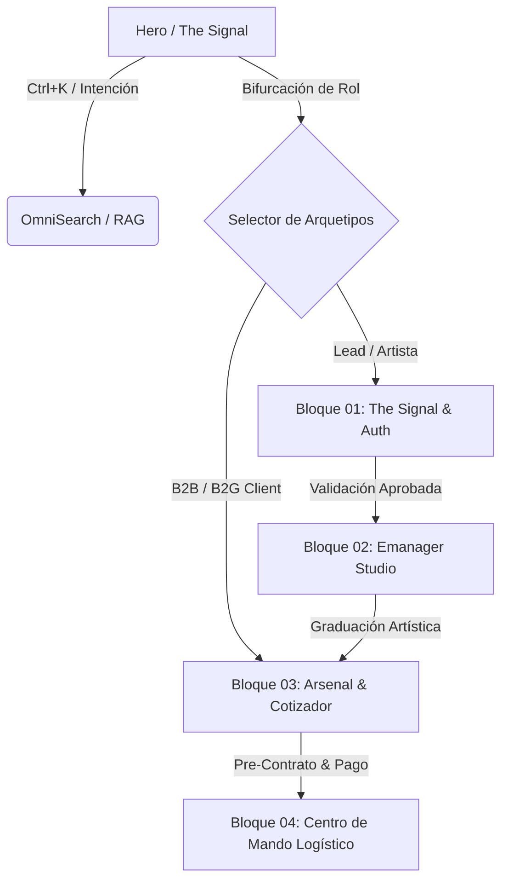

<!-- Manual EarOS -->
# MANUAL DE ARQUITECTURA S-CLASS: EAR OS V2 (BLUEPRINT DEFINITIVO)
**Documento Maestro de Construcción Forense | Silicon Valley Vanguard Edition**  
**SSOT:** `EAR_OS_STRATEGIC_ORCHESTRATOR_PLAN.md` | **Entorno:** `c:\EAR_OS_V2`  
**Stack de Referencia:** Next.js 19 (App Router, Turbopack), React 19 Server Components, TypeScript Estricto, Tailwind CSS v3.4+, Framer Motion, Zustand, PostgreSQL + Prisma / Supabase, Stripe Invariant Engine.

---

## ÍNDICE SISTÉMICO
1. **Filosofía del Sistema y Asimetría de Información**
2. **Matriz de Arquetipos, Necesidades y Adaptabilidad Contextual Dinámica**
3. **Arquitectura de 4 Clústeres de Negocio (Lotes de 10 Pantallas + Pantalla Separadora Inter-Bloque)**
   - *Bloque 01: El Embudo Soberano & Captura de Leads (The Signal & Auth Gateway)* [P01–P10 + P11 Separador]
   - *Bloque 02: Emanager Studio & Transformación Pedagógica (VIMUME & XP Engine)* [P12–P21 + P22 Separador]
   - *Bloque 03: El Arsenal & Marketplace de Contratación (B2B/B2G & Escasez Táctica)* [P23–P32 + P33 Separador]
   - *Bloque 04: Centro de Mando Logístico & Flota S-Class (Telemetría & Uber de Artistas)* [P34–P43]
4. **Ingeniería de Navegación, Flujos Lógicos y Matriz de CTAs**
5. **Momentos WOW y Coreografía de Micro-Interacciones (Framer Motion & Audio Feedback)**
6. **Especificación Técnica Bit-a-Bit para Equipo Fullstack Senior**
7. **Matriz de Seguridad, Roles RBAC, Idempotencia y Bóveda Soberana**
8. **Protocolo de Release, Gatekeeping de Producción y Recuperabilidad**

---

## 1. FILOSOFÍA DEL SISTEMA Y ASIMETRÍA DE INFORMACIÓN

EAR OS V2 no es un gestor de contenidos ni una aplicación transaccional estándar: es un **Sistema Operativo Soberano de Inferencia Cultural, Contratación Algorítmica y Telemetría Logística**.

```
   ┌──────────────────────────────────────────────────────────────┐
   │                    ASIMETRÍA DE INFORMACIÓN                  │
   ├──────────────────────────────┬───────────────────────────────┤
   │ MERCADO CONVENCIONAL         │ EAR OS V2 (SILICON VALLEY)    │
   ├──────────────────────────────┼───────────────────────────────┤
   │ Cotizaciones manuales lentas │ Bespoke Pricer en <300ms      │
   │ PDFs estáticos sin firmas    │ Bóveda de Contratos con Hash  │
   │ Gestión de rutas en WhatsApp │ Telemetría GPS + Waybill Real │
   │ Formularios genéricos fríos  │ The Signal: Filtro Forense    │
   │ Cero trazabilidad ODS        │ Ledger de Impacto Social VIMUME│
   └──────────────────────────────┴───────────────────────────────┘
```

El principio rector es la **Inmutabilidad y la Soberanía de Datos**: el usuario nunca experimenta una pantalla "muerta" o un formulario pasivo. Cada píxel responde a su contexto, rol y nivel de autoridad mediante transiciones orquestadas y persistencia sin fricción.

---

## 2. MATRIZ DE ARQUETIPOS Y SATISFACCIÓN DE NECESIDADES

| Arquetipo | Necesidad Principal | Fricción Evitada | Solución Dinámica EAR OS | Estrategia de CTA |
| :--- | :--- | :--- | :--- | :--- |
| **01. Visitante / Ciudadano (Top of Funnel)** | Encontrar propuesta artística o clínica sin registrarse. | Formularios invasivos, interfaces lentas. | Hero inmersivo, buscador neural instantáneo (`Ctrl+K`), micro-demos de audio lossless. | `"Iniciar Auditoría de Acceso"`, `"Explorar el Manifiesto"` |
| **02. Alumno / Artista (Student / Talent)** | Formación senior, monetización, repertorio y progreso real. | Cursos grabados estáticos sin feedback ni ROI. | Emanager Studio, gamificación XP, validación de prueba de trabajo (PoW), medidores Shark Mindset. | `"Validar Señal"`, `"Sincronizar Prueba de Trabajo"`, `"Reclamar XP"` |
| **03. Organizador B2B / Fincas de Bodas** | Certeza de presupuesto, disponibilidad y rider de sonido. | Días de espera por presupuestos y riders deficientes. | MultiPricer 360, configurador de fincas en tiempo real, desglose técnico Shure/Bose. | `"Calcular Despliegue Técnico"`, `"Bloquear Fecha en Bóveda"` |
| **04. Institución / B2G / Ayuntamientos** | Cumplimiento legal, alineación ODS 2030, fondos UE, FITUR. | Burocracia administrativa, falta de certificaciones. | Módulo B2G con generación de pre-contrato certificado, compliance auditado y sellos ODS. | `"Generar Expediente B2G"`, `"Descargar Dossier de Impacto ODS"` |

---

## 3. ARQUITECTURA DE 4 CLÚSTERES DE NEGOCIO (LOTES DE 10 PANTALLAS + SEPARADORES)

```
[ BLOQUE 01 (10) ] ──> [ P11 SEPARADOR ] ──> [ BLOQUE 02 (10) ] ──> [ P22 SEPARADOR ]
                            │                                             │
                            ▼                                             ▼
                     [ BLOQUE 03 (10) ] ──> [ P33 SEPARADOR ] ──> [ BLOQUE 04 (10) ]
```

---

### BLOQUE 01: EL EMBUDO SOBERANO & CAPTURA DE LEADS (The Signal & Auth Gateway)
*Unidad de Negocio:* Adquisición de Talento, Filtrado Forense y Gatekeeping de Alta Autoridad.

1. **Pantalla 01: Landing Page Inmersiva (Sovereign Hero - The Signal)**
   - *Propósito:* Impacto visual cinematográfico y declaración de asimetría informativa.
   - *Componentes:* Canvas de partículas doradas (`#D4AF37`), tipografía Cinzel de alta jerarquía, audio player binaural integrado.
   - *CTA Principal:* `"Iniciar Auditoría de Señal"`.

2. **Pantalla 02: Modal de Búsqueda Neural (OmniSearch / Ctrl+K Launcher)**
   - *Propósito:* Indexación y búsqueda semántica instantánea en <50ms sobre todo el catálogo de activos.
   - *Componentes:* Input de búsqueda reactivo con fuzzy matching sobre 80+ activos, chips de filtrado por intención.
   - *CTA Principal:* `"Ejecutar Inferencia"`.

3. **Pantalla 03: Selector de Roles Contextual (Role Identification Matrix)**
   - *Propósito:* Bifurcación del journey según el perfil (B2G, B2B, Artista, Ciudadano Senior).
   - *Componentes:* Tarjetas tácticas 3D interactuables con Framer Motion, detección automática de intención.
   - *CTA Principal:* `"Confirmar Identidad Operativa"`.

4. **Pantalla 04: Oráculo RAG Interactivo (The Signal - Inferencia Local)**
   - *Propósito:* Asistente conversacional con recuperación aumentada sobre la base de conocimiento EAR.
   - *Componentes:* Terminal de streaming por tokens con tema obsidiana (`#050505`) y citas de autoridad.
   - *CTA Principal:* `"Consultar Base de Conocimiento"`.

5. **Pantalla 05: Auditoría de Talento Forense (Paso 2 / Lead Qualification)**
   - *Propósito:* Formulario de preguntas no lineales para calificar el nivel del prospecto.
   - *Componentes:* Sliders analógicos virtuales, medidor de nivel de señal en decibelios (dB).
   - *CTA Principal:* `"Someter a Verificación"`.

6. **Pantalla 06: Estado de Revisión de Señal (Feedback Window / The Signal Score)**
   - *Propósito:* Presentación de resultados del diagnóstico forense con radar chart de capacidades.
   - *Componentes:* Radar SVG animado, score de autoridad de 0 a 100, dictamen algorítmico.
   - *CTA Principal:* `"Desbloquear Informe Completo"`.

7. **Pantalla 07: Brújula Ikigai EAR (Validación de Propósito y Dominio)**
   - *Propósito:* Matriz interactiva de intersección entre pasión, misión, vocación y profesión musical.
   - *Componentes:* Diagrama de Venn cuadrangular interactivo con drag-and-drop de habilidades.
   - *CTA Principal:* `"Consolidar Coordenadas Ikigai"`.

8. **Pantalla 08: Escáner de Objetos Brillantes (Filtro de Enfoque Estratégico)**
   - *Propósito:* Detección de distracciones operativas y tácticas de bajo retorno para artistas y promotores.
   - *Componentes:* Medidor de dispersión mental, semáforo de viabilidad comercial.
   - *CTA Principal:* `"Purgar Distracciones"`.

9. **Pantalla 09: Constructor de Embudos EAR (Validación de Ducto de Conversión)**
   - *Propósito:* Configuración visual de flujos de captación AIDA personalizados.
   - *Componentes:* Canvas de nodos conectables con cálculo de tasa de conversión teórica.
   - *CTA Principal:* `"Activar Ducto Soberano"`.

10. **Pantalla 10: Auth Gateway Soberano (Login Seguro & Encriptación)**
    - *Propósito:* Puerta de acceso blindada con autenticación multifactor y tokens de sesión inmutables.
    - *Componentes:* Formulario de credenciales con efecto de descifrado criptográfico visual.
    - *CTA Principal:* `"Acceder a la Bóveda"`.

---
* **SEPARADOR INTER-BLOQUE (Pantalla 11): Gateway de Transición / Neural Context Switcher**
  * *Propósito:* Pantalla de transición cinemática que detecta las credenciales del usuario y recalibra el tema global, cargando el estado de permisos y derivando fluidamente entre la Academia (Emanager), el Arsenal (Marketplace) o la Logística.
---

### BLOQUE 02: EMANAGER STUDIO & TRANSFORMACIÓN PEDAGÓGICA (VIMUME & XP Engine)
*Unidad de Negocio:* Academia de Alta Autoridad, Musicoterapia Sensorial e Impacto Social.

11. **Pantalla 12: Dashboard Maestro del Alumno (Círculo de Legado)**
    - *Propósito:* Panel central con tracking de nivel, puntos XP acumulados, rachas y lecciones pendientes.
    - *Componentes:* Barra de nivel dorada, tarjetas de módulos activos, feed de actividad del consorcio.
    - *CTA Principal:* `"Reanudar Entrenamiento"`.

12. **Pantalla 13: Portal de Centros de Mayores & Residencias Piloto (VIMUME Core)**
    - *Propósito:* Gestión de intervenciones de estimulación cognitiva y memoria sonora en residencias.
    - *Componentes:* Fichas de centros piloto, selector de cohortes y protocolos de sesión.
    - *CTA Principal:* `"Programar Sesión Sensorial"`.

13. **Pantalla 14: Módulo de Musicoterapia Sensorial (Memoria Sonora)**
    - *Propósito:* Reproductor clínico adaptativo por décadas musicales con monitor de respuesta emocional.
    - *Componentes:* Selector de épocas (años 50, 60, 70), interfaz de bio-feedback simplificado.
    - *CTA Principal:* `"Iniciar Estimulación Acústica"`.

14. **Pantalla 15: Currículum Maestro Nivel 1 (Cimientos del Talento)**
    - *Propósito:* Árbol de habilidades y módulos formativos con prerrequisitos de desbloqueo.
    - *Componentes:* Grafo interactivo de lecciones con indicadores de estado (Bloqueado/En Progreso/Dominado).
    - *CTA Principal:* `"Desbloquear Siguiente Nodo"`.

15. **Pantalla 16: Reproductor de Masterclasses & Lecciones Interactivas**
    - *Propósito:* Sala de visualización HD con transcripción sincronizada y panel de notas en tiempo real.
    - *Componentes:* Player de baja latencia, marcadores de tiempo con links a recursos técnicos.
    - *CTA Principal:* `"Completar y Reclamar +150 XP"`.

16. **Pantalla 17: Launchpad de Herramientas de Sesión & Protocolo de Mentoría**
    - *Propósito:* Kit de recursos prácticos para mentores (cronómetro de bloques, rúbricas de evaluación).
    - *Componentes:* Cronómetro táctico, checklist de 10 pasos de la sesión memorable.
    - *CTA Principal:* `"Iniciar Auditoría de Mentoría"`.

17. **Pantalla 18: Auditoría de Resultados (Shark Mindset Gauge)**
    - *Propósito:* Medición psicométrica de disciplina, agresividad comercial y ejecución de proyectos.
    - *Componentes:* Tacómetro SVG interactivo con aguja de tensión y zonas de rendimiento óptimo.
    - *CTA Principal:* `"Calibrar Mentalidad de Tiburón"`.

18. **Pantalla 19: Evaluación de Metodología 3C (Contenido, Comunidad, Conversión)**
    - *Propósito:* Diagnóstico triangular de la presencia en el mercado del artista.
    - *Componentes:* Gráfico de dispersión 3D con benchmarks de la industria.
    - *CTA Principal:* `"Optimizar Ecosistema 3C"`.

19. **Pantalla 20: Generador de Informes de Impacto Social & ODS 2030**
    - *Propósito:* Exportación de métricas de bienestar en mayores para acreditación ante la UE.
    - *Componentes:* Matriz de indicadores ODS (Salud y Bienestar, Reducción de Desigualdades), preview de PDF.
    - *CTA Principal:* `"Compilar Informe para Fondos Europeos"`.

20. **Pantalla 21: Certificación de Autoridad Soberana (Graduación y Badge)**
    - *Propósito:* Emisión de credencial digital criptográfica con sello EAR OS.
    - *Componentes:* Visualizador de certificado 3D con sello dorado holográfico y código QR de validación.
    - *CTA Principal:* `"Descargar Credencial Soberana"`.

---
* **SEPARADOR INTER-BLOQUE (Pantalla 22): Gateway Comercial / Pasarela de Conversión B2G y B2B**
  * *Propósito:* Nodo de salto de valor que transforma a los artistas graduados o los proyectos validados en activos contratables en el marketplace de infraestructura y contratación.
---

### BLOQUE 03: EL ARSENAL & MARKETPLACE DE CONTRATACIÓN (Rental, Booking & E-Commerce)
*Unidad de Negocio:* Monetización Directa, Alquiler de Infraestructura y Booking Corporativo/B2G.

21. **Pantalla 23: Catálogo Maestro de Infraestructura Técnica (El Arsenal)**
    - *Propósito:* Vista en rejilla de equipamiento de audio profesional, iluminación y escenarios.
    - *Componentes:* Filtros por categoría (Bose F1, Shure Beta 87A, XR18), indicador de disponibilidad en tiempo real.
    - *CTA Principal:* `"Inspeccionar Ficha Técnica"`.

22. **Pantalla 24: Ficha de Activo Premium (Rider de Sonido Deep-Dive)**
    - *Propósito:* Especificaciones técnicas de nivel broadcast y diagrama de conexiones I/O.
    - *Componentes:* Selector de configuraciones (Acústico, Banda Completa, Gala), visor de curvas de respuesta.
    - *CTA Principal:* `"Añadir a Configuración de Gira"`.

23. **Pantalla 25: Discovery de Talento (Booking Engine Maestro)**
    - *Propósito:* Catálogo curado de artistas solistas, mariachis, tenores y agrupaciones de élite.
    - *Componentes:* Tarjetas con previsualización de audio/video instantáneo, caché de repertorios.
    - *CTA Principal:* `"Ver Perfil de Autoridad"`.

24. **Pantalla 26: Ficha de Artista (Edwin Agudelo - Perfil de Autoridad)**
    - *Propósito:* Showcase de trayectoria, videos de alta resolución, géneros (Rancheras, Boleros) y rider.
    - *Componentes:* Carrusel de actuaciones, selector de formato de show, calendario de disponibilidad.
    - *CTA Principal:* `"Cotizar Espectáculo en Vivo"`.

25. **Pantalla 27: Configurador de Bodas y Fincas Exclusivas (`fincasparaboda.com`)**
    - *Propósito:* Mapeo de espacios singulares con cálculo automático de acústica y megafonía.
    - *Componentes:* Selector de finca, número de comensales, áreas (Ceremonia, Cóctel, Banquete, Fiesta).
    - *CTA Principal:* `"Bloquear Producción Integral"`.

26. **Pantalla 28: Calculadora de Inversión 360 (Bespoke Pricer & MultiPricer)**
    - *Propósito:* Algoritmo dinámico que calcula honorarios, kilometraje, dietas y técnicos sin recarga.
    - *Componentes:* Sliders de distancia (km desde base Madrid/Toledo), aforo, horas de actuación.
    - *CTA Principal:* `"Fijar Precio y Generar Pre-Contrato"`.

27. **Pantalla 29: Gestor de Exclusividad y Escasez Táctica (Tactical Scarcity HUD)**
    - *Propósito:* Notificación visual de cupos limitados por temporada o fecha señalada.
    - *Componentes:* Contador regresivo sincronizado, indicador de demanda concurrente ("3 promotores revisando").
    - *CTA Principal:* `"Garantizar Exclusividad Temporal"`.

28. **Pantalla 30: Generador Automatizado de Pre-Contratos B2G / B2B**
    - *Propósito:* Renderizado legal instantáneo con cláusulas de fuerza mayor, rider y términos de pago.
    - *Componentes:* Visor de documento con campos auto-rellenados y trazabilidad de hash SHA-256.
    - *CTA Principal:* `"Aprobar y Proceder a Firma"`.

29. **Pantalla 31: Pasarela de Pago Segura (Stripe Checkout Elite)**
    - *Propósito:* Procesamiento de anticipos y liquidaciones con idempotencia y confirmación inmediata.
    - *Componentes:* Elemento de pago blindado con soporte Apple Pay, tarjeta corporativa y transferencia bancaria.
    - *CTA Principal:* `"Confirmar Transacción Invariable"`.

30. **Pantalla 32: Bóveda Soberana de Contratos Firmados (Digital Contract Vault)**
    - *Propósito:* Archivo histórico inmutable de acuerdos comerciales con certificados de depósito.
    - *Componentes:* Tabla de contratos con filtros por estado (Firmado, En Ejecución, Liquidado).
    - *CTA Principal:* `"Descargar Contrato Sellado"`.

---
* **SEPARADOR INTER-BLOQUE (Pantalla 33): Gateway Logístico / Conexión Neural de Operaciones**
  * *Propósito:* Pasarela de telemetría que enlaza los contratos formalizados en el Bloque 03 con las órdenes de ruta, asignación de técnicos y despacho de vehículos del Bloque 04.
---

### BLOQUE 04: CENTRO DE MANDO LOGÍSTICO & FLOTA S-CLASS (Telemetría & Uber de Artistas)
*Unidad de Negocio:* Operaciones en Vivo, Logística de Giras y Telemetría de Campo.

31. **Pantalla 34: Command Center Logístico General (HUD Maestro)**
    - *Propósito:* Vista satelital de todos los eventos, transportes y dotaciones técnicas activas en tiempo real.
    - *Componentes:* Mapa oscuro interactivo con pins dinámicos de estado (Verde: OK, Ámbar: En Tránsito, Rojo: Alerta).
    - *CTA Principal:* `"Abrir Telemetría de Campo"`.

32. **Pantalla 35: Mapa de Calor de Demanda Institucional y Giras Activas**
    - *Propósito:* Densidad territorial de actuaciones y solicitudes B2G para optimización de rutas.
    - *Componentes:* Capa de calor sobre el mapa de España/Madrid/Castilla-La Mancha.
    - *CTA Principal:* `"Optimizar Corredor Logístico"`.

33. **Pantalla 36: Gestión de Flota de Vehículos (Citroën C-Crosser S-Class & Vans)**
    - *Propósito:* Telemetría mecánica, control de combustible, diagnosis FAP y mantenimiento preventivo.
    - *Componentes:* Tarjetas de estado vehicular con odómetro, estado de neumáticos y próxima ITV.
    - *CTA Principal:* `"Registrar Mantenimiento / Salida"`.

34. **Pantalla 37: Planificador de Hoja de Ruta (Waybill Forense / Showtime Timeline)**
    - *Propósito:* Cronograma al minuto desde la carga en almacén hasta el final del desmontaje.
    - *Componentes:* Línea temporal con hitos críticos (Check-in, Soundcheck, Showtime, Load-out).
    - *CTA Principal:* `"Sincronizar Waybill con Móviles"`.

35. **Pantalla 38: Live Tour Control (Sincronización en Vivo de Actuación)**
    - *Propósito:* Consola en cabina para el stage manager con setlist dinámico y tiempos de pase.
    - *Componentes:* Cronómetro de actuación gigante, control de bises, botón de aviso a camerinos.
    - *CTA Principal:* `"Marcar Fin de Setlist"`.

36. **Pantalla 39: Asignación de Técnicos de Sonido y Equipos en Ruta**
    - *Propósito:* Cuadrante de personal técnico cualificado y asignación de números de serie de equipos.
    - *Componentes:* Matriz drag-and-drop de técnicos a eventos con verificación de solapamientos.
    - *CTA Principal:* `"Confirmar Despliegue Técnico"`.

37. **Pantalla 40: Módulo de Alertas Tempranas de Incidencias Operativas**
    - *Propósito:* Monitorización de contingencias meteorológicas, retrasos en carretera o fallos técnicos.
    - *Componentes:* Feed de alertas con nivel de severidad y protocolos de contingencia pre-aprobados.
    - *CTA Principal:* `"Ejecutar Protocolo de Mitigación"`.

38. **Pantalla 41: Panel de Control Financiero y ROI de Artista (Admin Analytics)**
    - *Propósito:* Cuadro de mando de márgenes netos, costes de combustible, dietas y rentabilidad por bolo.
    - *Componentes:* Gráficos de cascada financiera, cálculo de payback por equipo amortizado.
    - *CTA Principal:* `"Cerrar Liquidación del Evento"`.

39. **Pantalla 42: Terminal de Sincronización con Obsidian & Base de Datos Soberana**
    - *Propósito:* Respaldo bidireccional de actas de gira y datos operacionales hacia el vault local de Obsidian.
    - *Componentes:* Consola de sincronización con logs de commits y verificación de checksums.
    - *CTA Principal:* `"Ejecutar Respaldo Soberano"`.

40. **Pantalla 43: Consola Maestra de Inferencia del Sistema y Estado del Kernel**
    - *Propósito:* Monitor global de salud de EAR OS V2 (latencia API, estado de base de datos y memoria RAG).
    - *Componentes:* Indicadores de disponibilidad de micro-servicios, latencia de base de datos y estado de los webhooks de Stripe.
    - *CTA Principal:* `"Verificar Integridad del Sistema"`.

---

## 4. INGENIERÍA DE NAVEGACIÓN, FLUJOS LÓGICOS Y MATRIZ DE CTAS

### Principio de Continuidad Contextual
En EAR OS V2, un usuario jamás aterriza en una vista descontextualizada. El motor de estado global (`useUserJourneyStore`) conserva:
1. Rol detectado o seleccionado (`role: 'lead' | 'student' | 'b2b_client' | 'b2g_institutional' | 'admin'`).
2. Nivel de autoridad y puntos XP acumulados.
3. Configuración en curso del cotizador (fecha, aforo, requerimientos técnicos).
4. Estado de los pre-contratos y reservas.



### Reglas de Oro de CTAs
- **Prohibido:** Textos genéricos como `"Enviar"`, `"Registrarse"`, `"Click aquí"`, `"Aceptar"`.
- **Obligatorio:** Textos de mandato soberano y alta autoridad:
  * `"Iniciar Auditoría de Acceso"`
  * `"Ejecutar Inferencia Local"`
  * `"Bloquear Fecha en Bóveda"`
  * `"Validar Prueba de Trabajo (+100 XP)"`
  * `"Generar Expediente B2G Certificado"`

---

## 5. MOMENTOS WOW Y COREOGRAFÍA DE MICRO-INTERACCIONES

1. **Momento Wow 01: El Despliegue del Oráculo (`Ctrl+K`)**
   - *Efecto:* Difuminado de fondo con desenfoque de 24px (`backdrop-blur-xl`), aparición de la consola con animación elástica de Framer Motion (`stiffness: 400, damping: 30`) y streaming de caracteres dorados con sonido sutil de teletipo sintético.
2. **Momento Wow 02: Cotización Paramétrica en Tiempo Real (MultiPricer)**
   - *Efecto:* Al deslizar el slider de distancia en km o aforo, los números rotan con efecto de odómetro mecánico, las barras de rider técnico se iluminan en tiempo real y el total final se sella con un destello dorado (`gold-shimmer`).
3. **Momento Wow 03: Desbloqueo de Nivel y Reclamación de XP**
   - *Efecto:* Al validar una lección o prueba de trabajo, una onda expansiva dorada recorre la pantalla, el contador global de XP se incrementa con sonido armónico de campana tibetana sintetizada y el badge 3D rota 360 grados sobre su eje.
4. **Momento Wow 04: Telemetría de Gira en el HUD de Operaciones**
   - *Efecto:* El mapa nocturno se ilumina con trazas de vectores en movimiento que representan los vehículos en ruta, sincronizando datos de GPS simulados con actualización instantánea de la hora estimada de llegada (ETA).

---

## 6. ESPECIFICACIÓN TÉCNICA BIT-A-BIT PARA EQUIPO FULLSTACK SENIOR

### Jerarquía de Directorios del Código Fuente
```
src/
├── app/                        # Next.js App Router (Páginas y Server Actions)
│   ├── (auth)/                 # Rutas de autenticación y gatekeeping
│   ├── (dashboard)/            # Vistas privadas (Studio, Arsenal, Ops)
│   ├── api/                    # Endpoints de inferencia, webhooks y exportación
│   ├── layout.tsx              # Shell global con fuentes Cinzel y Montserrat
│   └── page.tsx                # Hero inmersivo soberano
├── components/
│   ├── ui/                     # Componentes atómicos (Botones, Sliders, Modales)
│   ├── audio/                  # Reproductores lossless, analizador de espectro
│   ├── pricer/                 # Calculadora MultiPricer 360 y desgloses
│   └── telemetry/              # Mapas satelitales, tacómetros SVG, HUDs
├── lib/
│   ├── db.ts                   # Cliente Prisma singleton con pooling
│   ├── stripe.ts               # Cliente Stripe con firma inmutable de webhooks
│   ├── rag_engine.ts           # Motor de inferencia y embeddings locales
│   └── store.ts                # Zustand global state (XP, Carrito, Filtros)
└── styles/
    └── globals.css             # Directivas Tailwind, animaciones de brillo dorado
```

### Directrices de Implementación
* **Cero Hydration Mismatches:** Componentes dependientes del navegador (audio, geolocalización, canvas) deben encapsularse con `dynamic(() => import(...), { ssr: false })` o protegerse con un hook `useMounted()`.
* **Manejo de Estados con Zustand:**
  ```typescript
  interface SystemState {
    currentXP: number;
    userRole: 'lead' | 'student' | 'b2b_client' | 'b2g_institutional' | 'admin';
    activeQuote: QuoteConfig;
    addXP: (amount: number) => void;
    setRole: (role: SystemState['userRole']) => void;
  }
  ```
* **CSS Tokens de Élite:**
  * Fondo Obsidiana: `bg-[#050505]` / `bg-[#0a0a0c]`
  * Oro EAR Soberano: `text-[#D4AF37]` / `border-[#D4AF37]/40`
  * Glow de Autoridad: `box-shadow: 0 0 25px rgba(212, 175, 55, 0.15)`

### Invariantes de Infraestructura Crítica

#### 5.1. Invariante de Conexión a Base de Datos (Pool & Proxy Safety)
- Queda estrictamente prohibido instanciar `new PrismaClient()` fuera del Singleton resguardado en `globalThis`.
- Toda interacción con la base de datos en entornos Serverless o Edge debe canalizarse exclusivamente a través del endpoint de Connection Pooling (puerto 6543 / PgBouncer o Prisma Accelerate).
- Las migraciones DDL (`prisma migrate`) deben ejecutarse de forma aislada sobre la URL directa sin pooling (puerto 5432).

#### 5.2. Contrato de Gateway de Entrada (Rule of Zero-Anonymity)
- La ruta raíz `/` es el Selector Contextual de 4 Perfiles (B2G Institucional, B2B Eventos/Fincas, Artista/Talento, Ciudadano/VIMUME).
- Ninguna vista interna (`/cotizador`, `/admin`, `/centro-mando`, `/artistas/dashboard`) puede ser renderizada como landing por defecto si no existe una sesión o rol persistido en el estado global (`SharedContext` / `Zustand`).

---

## 7. MATRIZ DE SEGURIDAD, ROLES RBAC Y BÓVEDA SOBERANA

* **Nivel 0 (Público):** Vistas del Bloque 01 (Hero, OmniSearch, Catálogo preliminar). Sin acceso a datos de costes desglosados ni telemetría.
* **Nivel 1 (Estudiante / Artista):** Acceso al Emanager Studio (Bloque 02). Lectura de lecciones, escritura de pruebas de trabajo y consulta de su propio XP.
* **Nivel 2 (Cliente B2B / Institucional B2G):** Acceso al Arsenal y Cotizador (Bloque 03). Capacidad para emitir pre-contratos, firmar electrónicamente y acceder a su repositorio de facturas y riders.
* **Nivel 3 (Comando Operativo & Admin):** Acceso integral al Centro de Mando Logístico (Bloque 04), mapas de telemetría, gestión financiera y auditoría de integridad del sistema.

---

## 8. PROTOCOLO DE RELEASE Y GATEKEEPING DE PRODUCCIÓN

Antes de autorizar cualquier despliegue hacia entorno de Preview o Producción, el equipo debe verificar la siguiente lista de control inmutable:

1. `npx tsc --noEmit` ejecuta con **0 errores**.
2. Los webhooks de Stripe verifican la firma criptográfica sobre el `rawBody` antes de cualquier mutación en base de datos.
3. No existen secretos, API keys o variables privadas expuestas en el bundle cliente (`NEXT_PUBLIC_` auditado).
4. Todas las rutas dinámicas implementan estados de carga (`loading.tsx`), error (`error.tsx`) y pantallas no encontradas (`not-found.tsx`).
5. El SSOT (`EAR_OS_STRATEGIC_ORCHESTRATOR_PLAN.md`) y el `Manual EarOS.md` se encuentran perfectamente reconciliados.

---

**ESTADO DEL BLUEPRINT:** FREEZE TÁCTICO CERTIFICADO  
**AUTORIDAD:** ABSOLUTA  
**EL CÓDIGO ES LEY. EL DESPLIEGUE COMIENZA AHORA.**
