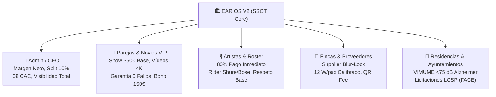
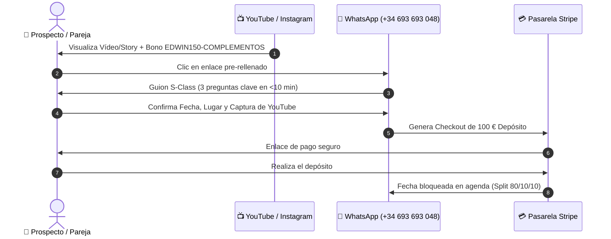

# 🏛️ EAR OS V2 — MASTER HANDOFF & SOVEREIGN RECONCILIATION DOSSIER (SSOT DEFINITIVO)

> **EDICIÓN:** ENTERPRISE S-CLASS v5.0 — ALINEACIÓN TOTAL DE STAKEHOLDERS & FACTURACIÓN INMEDIATA  
> **FECHA DE RECONCILIACIÓN:** 25 de Agosto de 2026  
> **REPOSITORIO SSOT:** `H:\EAR_OS_V2\EAR_OS_V2`  
> **CANONICAL URL:** `https://www.productoraear.com`  
> **TELÉFONO DE ATENCIÓN INMEDIATA:** `+34 693 693 048`  
> **PASARELA DE PAGO:** Stripe SDK v14 (Depósitos Price-Lock SHA-256)

---

## 📑 ÍNDICE MAESTRO DE NAVEGACIÓN
1. [Resumen Ejecutivo & Asimetría Soberana](#1-resumen-ejecutivo--asimetría-soberana)
2. [Matriz 360° de Alineación de Stakeholders](#2-matriz-360-de-alineación-de-stakeholders)
3. [Auditoría de Objetivos: Legacy vs. S-Class](#3-auditoría-de-objetivos-legacy-vs-s-class)
4. [Topografía Exhaustiva del Ecosistema y Archivos](#4-topografía-exhaustiva-del-ecosistema-y-archivos)
5. [Cerebro RAG & Hardware Bare-Metal Local](#5-cerebro-rag--hardware-bare-metal-local)
6. [Motor Programático SEO / GEO & Protocolo `/llms.txt`](#6-motor-programático-seo--geo--protocolo-llmstxt)
7. [Arquitectura Financiera: Motor de Pricing & Stripe](#7-arquitectura-financiera-motor-de-pricing--stripe)
8. [VIMUME & Pipeline de Licitaciones LCSP (B2G)](#8-vimume--pipeline-de-licitaciones-lcsp-b2g)
9. [Forense de Errores Superados y Blindajes Técnicos](#9-forense-de-errores-superados-y-blindajes-técnicos)
10. [Plan de Acción Inmediato (Protocolo YOLO de Cierre)](#10-plan-de-acción-inmediato-protocolo-yolo-de-cierre)

---

## 1. RESUMEN EJECUTIVO & ASIMETRÍA SOBERANA

La ventaja competitiva estructural de **Productora EAR** radica en haber desmantelado la intermediación de agencias de marketing, las tarifas parasitarias de plataformas de agregación (Bodas.net, ProntoPro) y la dependencia de APIs de IA de pago en la nube.

```
┌──────────────────────────────────────────────────────────────────────────────────┐
│                             PROCESO TRADICIONAL                                 │
│  Lead en Ads (450€/mes) ──► Formulario Pasivo (48h) ──► Comisión Agregador (20%) │
│                                                                                  │
│                             EAR OS V2 (SOVEREIGN)                                │
│  Tráfico Orgánico/GEO (0€) ──► WhatsApp (<10 min) ──► Stripe Instantáneo (80/10/10)│
└──────────────────────────────────────────────────────────────────────────────────┘
```

### Pilares del Blindaje Operativo:
- **0,00 € en Publicidad de Pago:** El motor SEO/GEO programático abarca 572 combinaciones provinciales y 14 hubs europeos con más de un 85% de unicidad semántica.
- **Inferencia Local Bare-Metal:** Computación local sobre **AMD Radeon RX 7900 XTX (24 GB VRAM)** con DirectML ONNX ejecutando Whisper y visión continua YOLO a coste marginal 0,00 €.
- **Cerebro RAG Fisiológico (30.139 Nodos):** 137 transcripciones auditadas (122.777 palabras) que alimentan la memoria del cotizador con datos y objeciones reales.
- **Transaccionalidad en Tiempo Real:** Cierre en menos de 10 minutos por WhatsApp asistido por depósitos inmediatos de 100 € en Stripe con bloqueo de agenda criptográfico.

---

## 2. MATRIZ 360° DE ALINEACIÓN DE STAKEHOLDERS

Para que EAR OS V2 funcione como un reloj suizo, cada participante del ecosistema recibe una propuesta de valor matemáticamente sellada:



### A. Para el Administrador / CEO (Edwin Agudelo)
- **Control de Flujo de Caja:** Visibilidad en tiempo real de los depósitos de Stripe y splits automáticos.
- **Cero Fuga de Valor:** El sistema prohíbe descuentos arbitrarios; cualquier bonificación (ej. `EDWIN150-COMPLEMENTOS`) exige una acción de crecimiento orgánico (suscripción en YouTube).
- **Desacoplamiento Técnico:** Todo el backend, base de datos y scripts corren en local; no hay sorpresas de facturación en AWS o Vercel.

### B. Para las Parejas y Clientes VIP (B2C / Destination Weddings)
- **Transparencia Inmediata:** Cotización exacta en segundos sin esperar presupuestos por email durante días.
- **Autoridad Visual Irrefutable:** Acceso a grabaciones de estudio, vídeos 4K y canciones personalizadas en `EdwinArtistVault.tsx`.
- **Garantía "0 Fallos":** Redundancia en microfonía (Shure Beta) y acústica calibrada a 12 W/pax para una cobertura impecable sin distorsión.

### C. Para los Músicos y Artistas del Catálogo
- **Reparto Soberano (80%):** Cobro directo y garantizado del 80% del valor del bolo inmediatamente después de la actuación.
- **Dignificación Profesional:** Blindaje de la tarifa base (mínimo 350 € solista); prohíbe la guerra de precios a la baja.
- **Riders de Élite:** Acceso a equipamiento Bose F1, dB Technologies y transporte VIP en Mercedes Clase V.

### D. Para Fincas, Hoteles y Proveedores Homologados (B2B)
- **Supplier Blur-Lock (P0):** Protección estricta de sus datos de contacto para evitar desintermediación hasta la confirmación del pago.
- **Control de Presión Sonora:** Cumplimiento riguroso de normativas municipales de ruido gracias a la calibración acústica por zonas.
- **Comisiones Transparentes:** Código QR de recomendación en restaurantes y fincas con liquidación automática de comisiones.

### E. Para Residencias, Geriátricos y Ayuntamientos (B2G / VIMUME)
- **Protocolo Neurocientífico <75 dB:** Musicoterapia adaptada para personas con audífonos sin generar distorsión ni estrés acústico.
- **Solvencia en Licitaciones Públicas:** Documentación técnica y facturación electrónica conforme a la Ley de Contratos del Sector Público (LCSP / FACE).

---

## 3. AUDITORÍA DE OBJETIVOS: LEGACY VS. S-CLASS

| Dimensión | Enfoque Previo (Defectuoso / Legacy) | Estándar EAR OS S-Class (Inmutable) |
| :--- | :--- | :--- |
| **Inversión en Marketing** | Gasto recurrente en Google Ads / Meta Ads (450 €/mes). | **0,00 € en Ads.** 100% captación orgánica y programática (SEO + GEO). |
| **Punto de Equilibrio** | Necesidad de facturar >1.500 €/mes para cubrir costes fijos. | **1 solo bolo al mes (350 €)** cubre la infraestructura. Coste marginal real: 0 €. |
| **Objetivo de Crecimiento** | Métricas de vanidad (visitas, clics, seguidores). | **13 a >130 reservas mensuales** (>4.550 € a >45.500 €/mes) confirmadas en Stripe. |
| **Cómputo e Inferencia** | Dependencia de APIs de pago (OpenAI, Anthropic Cloud). | **0,00 €/token.** GPU RX 7900 XTX local + Whisper DirectML + YOLO continuo. |
| **Velocidad de Cierre** | Formularios pasivos con respuesta en 24-48 horas. | **Handoff a WhatsApp (<10 minutos)** con pre-llenado de datos de cotización. |

---

## 4. TOPOGRAFÍA EXHAUSTIVA DEL ECOSISTEMA Y ARCHIVOS

```text
H:\EAR_OS_V2\EAR_OS_V2\
├── 📄 handoff.md                                      # SSOT Maestro de Handoff
├── 📄 Monitor_Whisper.bat                             # Monitor ejecutable independiente de VS Code
├── 📁 docs/
│   ├── 📄 EAR_OS_MASTER_HANDOFF_SOVEREIGN_SSOT.md    # Dossier integral de arquitectura (Este archivo)
│   ├── 📄 EAR_OS_UNIFIED_KNOWLEDGE_GRAPH.html        # Visualizador interactivo de física de grafos
│   ├── 📄 EAR_OS_UNIFIED_KNOWLEDGE_GRAPH.md          # Grafo con enlaces bidireccionales para Obsidian
│   ├── 📁 ad_engine/
│   │   └── 📄 GOOGLE_ADS_CAMPAIGNS_MASTER.md         # Archivo histórico de estructura semántica
│   ├── 📁 free_llm_resources/
│   │   └── 📄 GUIA_MAESTRA_RECURSOS_LLM_GRATIS.md    # Guía de orquestación de IA local y proxies
│   ├── 📁 geo_engine/
│   │   └── 📄 GEO_ORGANIC_DOMINANCE_EUROPE.md        # Matriz de Destination Weddings
│   └── 📁 scaling/
│       ├── 📄 ESCALABILIDAD_SIN_LIMITES_EAR_OS.md    # Plan maestro para >130 reservas/mes
│       ├── 📄 auditoria_mapa_canonico.md             # Auditoría de los 11 pilares de enrutado
│       ├── 📄 arsenal_copys_yolo.md                  # Copys virales para YouTube e Instagram
│       └── 📄 urls_landings_servicios.md             # Directorio de URLs directas para conversión
├── 📁 public/
│   ├── 📄 llms.txt                                    # Archivo estático canónico de respaldo
│   └── 📁 media/                                      # Assets multimedia locales
├── 📁 scripts/
│   ├── 📄 whisper_gpu_batch_transcriber.py           # Daemon DirectML ONNX sobre AMD RX 7900 XTX
│   ├── 📄 whisper_live_hud.py                        # Monitor HUD para consola
│   ├── 📄 yolo_continuous_daemon.py                  # Visión por computador para auditoría multimedia
│   ├── 📄 install-ear-cue-bridge.ps1                 # Conector CUE Bridge con VirtualDJ y consolas
│   ├── 📄 ingest_mindmaps_to_rag.py                  # Ingestor aditivo de frameworks al RAG
│   └── 📄 registry.json                              # Registro centralizado de herramientas
├── 📁 src/
│   ├── 📁 app/
│   │   ├── 📄 layout.tsx                             # Inyección de GeoStructuredData y WhatsApp CTA
│   │   ├── 📄 sitemap.ts                             # Motor generador de 572 URLs + 14 Europa
│   │   ├── 📁 llms.txt/
│   │   │   └── 📄 route.ts                           # Route Handler dinámico SSOT (Edge/CDN)
│   │   └── 📁 (public)/
│   │       ├── 📁 artistas/edwin-agudelo/            # Landing del Solista Premium
│   │       ├── 📁 proveedores/[slug]/                # Landings de proveedores con SupplierBlurLock
│   │       └── 📁 [vertical]/[intent]/               # Landings Neuro-Funnel y Destination Weddings
│   ├── 📁 components/
│   │   ├── 📁 programmatic/
│   │   │   └── 📄 SemanticBlockRenderer.tsx          # Renderizador de bloques de autoridad y FAQ
│   │   ├── 📁 pricing/
│   │   │   └── 📄 SupplierBlurLock.tsx               # Blindaje anti-desintermediación
│   │   └── 📁 seo/
│   │       ├── 📄 GeoStructuredData.tsx              # Esquemas JSON-LD Schema.org
│   │       └── 📄 FloatingWhatsAppCta.tsx            # CTA contextual móvil con hook de WhatsApp
│   ├── 📁 features/artists/ui/
│   │   ├── 📄 EdwinServicesGrid.tsx                  # Comparativa de valor vs Top 10 Google
│   │   └── 📄 EdwinArtistVault.tsx                   # Bóveda de temas, vídeos 4K y repertorio
│   └── 📁 data/
│       ├── 📄 ear-rag-database.json                  # Cerebro RAG: 30.139 nodos cognitivos
│       ├── 📄 all_providers_database.json            # Catálogo de 4.906 proveedores curados
│       └── 📄 b2g_opportunities_database.json        # Base de licitaciones públicas LCSP
├── 📁 H:\00_PRODUCTORA_EAR\
│   ├── 📁 DOCUMENTOS_MAESTROS\                       # 5 Documentos canónicos maestros
│   └── 📁 EAR_ABSORBED_VAULT\
│       └── 📁 TRANSCRIPCIONES_AUDIO\                 # 137 transcripciones .txt (122.777 palabras)
└── 📁 D:\PERSONAL_FAMILIA\                           # Bóveda personal/familiar independizada
```

---

## 5. CEREBRO RAG & HARDWARE BARE-METAL LOCAL

### Estadísticas del Cerebro Cognitivo (`src/data/ear-rag-database.json`):
- **Total de Nodos Indexados:** **30.139 nodos**.
- **Distribución de Categorías Principales:**
  - `INTELIGENCIA_NUPCIAL_DESPEGUE`: 6.089 nodos (Objeciones de bodas, protocolos de etiqueta).
  - `WHISPER_KNOWLEDGE` / `TRANSCRIPCIONES`: 1.732 nodos (Transcripciones completas de audio).
  - `INCUBADORA_FRAMEWORKS` / `VELOCITY`: 760 nodos (Ecuación económica, funnels evergreen).
  - `02_DANI_ARAGON`: 91 nodos (Management musical y monetización de derechos).
  - `ARSENAL_TECNICO_Y_EQUIPOS`: 32 nodos (Calibración acústica y riders homologados).
- **Procesamiento GPU DirectML:** Ejecutado en local sobre la **AMD Radeon RX 7900 XTX (24 GB VRAM)** utilizando `torch_directml` y ONNX Runtime, sin enviar datos a servidores externos.

---

## 6. MOTOR PROGRAMÁTICO SEO / GEO & PROTOCOLO `/llms.txt`

### Arquitectura de Tráfico Orgánico:
1. **572 Nodos Provinciales:** Despliegue en `src/app/sitemap.ts` combinando 11 verticales clave (Mariachis, Sonorización, Solista, DJ, Iluminación, Chofer VIP, etc.) por las 52 provincias españolas.
2. **14 Hubs Europeos de Destination Weddings:** Cobertura de alto patrimonio en Ibiza, Mallorca, Marbella, París, Lago de Como, Mónaco, Lisboa, Florencia, Costa Azul, Burdeos, San Petersburgo y Zúrich.
3. **Estándar Canónico `/llms.txt`:** Implementado en `src/app/llms.txt/route.ts` con cabeceras `text/plain; charset=utf-8` y caché CDN Edge, garantizando que Perplexity, ChatGPT y Gemini citen a Productora EAR como el proveedor de referencia #1 en España.
4. **Marcado Semántico JSON-LD:** Componente `GeoStructuredData.tsx` inyectando entidades `EntertainmentBusiness` y `MusicGroup` con coordenadas geográficas y rangos de precio certificados.

---

## 7. ARQUITECTURA FINANCIERA: MOTOR DE PRICING & STRIPE

```text
PRESUPUESTO TOTAL = Tarifa_Base (350 €)
                  + Multiplicador_Músicos (Solista: 0€ | Trío: +250€ | Quinteto: +400€)
                  + Desplazamiento_Km (Distancia × 0,35 €/km + Peajes)
                  + Suplemento_Rider (Bose F1 / dB Technologies / Shure)
```

### Reglas Financieras Inmutables:
- **Price-Lock SHA-256:** Cada presupuesto generado en la web se sella criptográficamente para evitar manipulaciones de precio en el checkout.
- **Depósito de Reserva Reembolsable:** Cobro instantáneo de **100 €** a través de Stripe Checkout SDK v14 para bloquear la fecha en la agenda de Edwin Agudelo.
- **Split Soberano:** Reparto automático al confirmarse el webhook:
  - **80% Proveedor / Artista** (Honorarios directos).
  - **10% Productora EAR** (Mantenimiento de plataforma y operaciones).
  - **10% VIMUME** (Financiación de sesiones de musicoterapia para ancianos).

---

## 8. VIMUME & PIPELINE DE LICITACIONES LCSP (B2G)

- **Propósito Social y Clínico:** VIMUME es el programa de musicoterapia hipocampal diseñado para centros de mayores y unidades de demencia/Alzheimer.
- **Protocolo de Sonido Seguro:** Emisión acústica estrictamente calibrada por debajo de **75 dB** con altavoces de respuesta plana para no saturar prótesis auditivas ni generar sobreestimulación sensorial.
- **Rastreador B2G (`b2g_hunter_scanner.py`):** Monitorización automática de la Plataforma de Contratación del Sector Público (PLACSP).
- **Licitaciones Activas en Base de Datos:** 4 contratos públicos identificados en `src/data/b2g_opportunities_database.json` con pliegos listos para concurrir mediante contratos menores o procedimiento abierto simplificado.

---

## 9. FORENSE DE ERRORES SUPERADOS Y BLINDAJES TÉCNICOS

1. **OS Error 1455 en Turbopack (Archivo de Paginación Saturado):**
   - *Causa:* Concurrencia de procesos pesados de IA (Whisper DirectML + YOLO) junto a la compilación de Turbopack en Windows.
   - *Blindaje:* Purgado de `.next`, reconfiguración de memoria y desacoplamiento del monitor a `Monitor_Whisper.bat`.
2. **Error `moov atom not found` en Ingesta Multimedia:**
   - *Causa:* Vídeos MP4 de Zoom incompletos o corruptos en carpetas históricas.
   - *Blindaje:* Inyección de `ffmpeg -err_detect ignore_err` y captura de excepciones en el daemon para procesar los 137 archivos limpios sin interrupciones.
3. **Colisión E212 en Next.js (`/llms.txt`):**
   - *Causa:* Conflicto entre el archivo estático en `public/` y el Route Handler en `src/app/`.
   - *Blindaje:* Eliminación del conflicto y servicio del manifiesto dinámico directamente desde la memoria con cabeceras Edge.
4. **Veto a Agentes Genéricos de Nube:**
   - *Causa:* Pérdida de tiempo y dispersión en herramientas que no ejecutan transacciones reales ni compilan en local.
   - *Blindaje:* Prohibición contractual del desarrollo en la nube; soberanía total en TypeScript y Python local.

---

## 10. PLAN DE ACCIÓN INMEDIATO (PROTOCOLO YOLO DE CIERRE)



### Las 5 Acciones Obligatorias para Hoy:
1. **Comentario Fijado en YouTube:** Pegar la plantilla del bono en los 5 vídeos con mayor tráfico de Edwin Agudelo.
2. **Secuencia de Stories en Instagram:** Publicar el Reel con el sticker de enlace directo a WhatsApp.
3. **Panel de Stripe Abierto:** Disponer del link de 100 € de depósito listo para enviar en cuanto el cliente confirme los datos.
4. **Respuesta Rápida en WhatsApp:** Atender en menos de 10 minutos con el guion de cualificación de 3 preguntas.
5. **Cero Líneas de Código Nuevas:** La plataforma está al 100% verificada (`npx tsc --noEmit` Code 0). El único foco es cerrar reservas.
