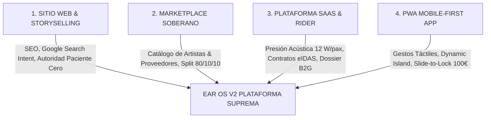
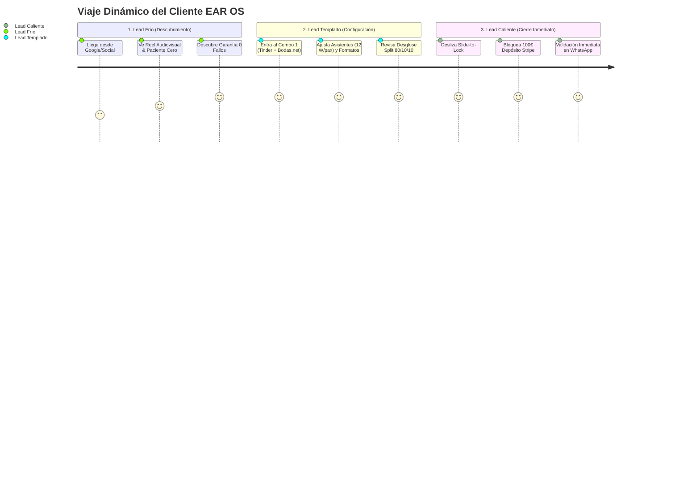

# 🏛️ MANUAL MAESTRO DE USO: MOBILE FUSION S-CLASS & EAR OS V2

**Documento de Gobernanza Operativa y Guía de Arquitectura de Conversión**  
**Versión:** Enterprise High-Signal v3.0 — Modo CEO Activo  
**SSOT:** `EAR_OS_STRATEGIC_ORCHESTRATOR_PLAN.md`

---

## 🧭 1. ¿QUÉ ES EAR OS V2? (LA NATURALEZA DE LA PLATAFORMA)

EAR OS **no es una simple web ni una app aislada**; es un **Ecosistema Operativo Omnipresente (Progressive Web OS)** que fusiona cuatro dimensiones clave:

1. **Sitio Web de Alto Tráfico & Autoridad (Storyselling)**:
   - Indexación en Google Search Console (`productoraear.com`), SEO semántico de alta densidad y captación orgánica.
   - Posicionamiento de Edwin Agudelo como *Paciente Cero / Master Artist* con 37+ conciertos internacionales.

2. **Marketplace Soberano & Transparente**:
   - Plataforma curada de artistas y proveedores técnicos.
   - **Split Soberano Inmutable**: **80% Artista / 10% EAR OS / 10% Fondo Social VIMUME**.

3. **Plataforma de Operaciones, Logística & Contratación (SaaS)**:
   - Cotizador algorítmico, cálculo de kilometraje, calibración acústica homologada (**12 W/pax**) y contratos con firma digital eIDAS y dossiers para licitaciones B2G.

4. **Web App Mobile-First de Ultra-Lujo (PWA / Progressive Web App)**:
   - Funciona de forma instantánea en cualquier navegador móvil (iPhone / Android) sin obligar a descargar nada de la App Store, pero con la fluidez táctil nativa de Tinder, Uber, Airbnb y Bodas.net.

---

## 👑 2. COMBO 1: THE VIP WEDDING GALA 360° (DISEÑO PRINCIPAL ACTIVO)

El **Combo 1** ha sido seleccionado como la experiencia móvil por defecto. Integra la sinergia de los 4 gigantes:

| Bloque | Plataforma Inspiradora | Función S-Class |
| :--- | :--- | :--- |
| **Cabecera** | **iOS 18+ Dynamic Island** | Píldora flotante con estado de cotización en vivo, cálculo de potencia acústica (`W RMS`) y estado de bloqueo de fecha. |
| **Descubrimiento** | **Tinder Discovery Deck** | Tarjeta táctil con porcentaje de afinidad nupcial (`99% Match`), muestra de voz en directo con **Waveform animado** y conmutador rápido de formatos (Solista 350€, Cuarteto 950€, Gala 1450€, Monumental 2800€). |
| **Logística** | **Bodas.net Timeline 360°** | Orquestador cronológico por hitos (*1. Ceremonia → 2. Cóctel → 3. Banquete → 4. Barra Libre*) con asignación modular y control de volumen dB. |
| **Autoridad** | **Airbnb Superhost & Split** | Ficha de honor de *Edwin Agudelo (Paciente Cero)* con desglose transparente del Split 80/10/10 y seguro RC 1.000.000€. |
| **Cierre CTA** | **Uber Slide-to-Lock** | Barra táctil deslizante que bloquea atómicamente la fecha con **100 € de depósito Stripe (Price-Lock SHA-256)** y dispara el payload completo a WhatsApp (+34 693 693 048). |

---

## 🌡️ 3. MOTOR DE TEMPERATURA DE LEADS (VIAJE DINÁMICO DEL CLIENTE)

El sistema clasifica y conduce dinámicamente al lead según su grado de madurez y decisión de compra:

### Protocolos por Temperatura:
1. ❄️ **Lead Frío (0° a 35°)**:
   - *Intención*: "Estoy buscando opciones para mi boda/evento, no os conozco."
   - *Ruta del Sistema*: Muestra Reels audiovisuales verticales (*Alt 9*), sellos de 37+ conciertos internacionales, 0 fallos acústicos y biografía de Edwin Agudelo.
2. 🌤️ **Lead Templado (36° a 75°)**:
   - *Intención*: "Tengo fecha tentativa y quiero comparar formatos y presupuesto cerrado."
   - *Ruta del Sistema*: Despliega el **Combo 1** (Tinder Swipe + Timeline Bodas.net + Matriz de Potencia Acústica 12 W/pax).
3. 🔥 **Lead Caliente (76° a 100°)**:
   - *Intención*: "Tengo la fecha cerrada y no quiero que otro cliente me quite el día."
   - *Ruta del Sistema*: Activa el **Slide-to-Lock** de 100 € con Stripe y redirección a WhatsApp para recepción de contrato formal.

---

## 🛠️ 4. GUÍA DEL ESTUDIO DE ADMINISTRACIÓN (`/admin/mobile-studio`)

El CEO y los administradores tienen control total para personalizar y reconfigurar la experiencia móvil sin tocar código:

URL del Estudio:
👉 **`http://localhost:3007/admin/mobile-studio`** (o en pestaña *Mobile Fusion Studio* en `/admin`).

### Pestañas del Estudio:
1. **Pestaña 1 — Combos Sugeridos (5 Presets)**:
   - **Combo 1**: *The VIP Wedding Gala 360°* (Activo).
   - **Combo 2**: *The Fast B2B & Logistics Dispatcher* (Enfoque Uber + 12W/pax).
   - **Combo 3**: *The Curated Airbnb Luxury Stays* (Enfoque Bento + Superhost).
   - **Combo 4**: *The Storyselling Emotion Reel* (Enfoque Video Vertical + Conversión).
   - **Combo 5**: *The Sovereign Master Fusion 360°* (Enfoque All-in-One con pestañas).
2. **Pestaña 2 — Mezclador Lego**:
   - Permite combinar de forma granular: Cabecera + Descubrimiento + Logística + Cierre CTA.
   - Cuenta con botón **"Guardar Configuración"** que persiste la elección en el navegador.
3. **Pestaña 3 — Catálogo de los 10 Arquetipos**:
   - Permite consultar y probar de forma individual cualquiera de las 10 alternativas originales creadas.

---

## 📊 5. REGLAS DE NEGOCIO Y PRICING INMUTABLES (SSOT)

- **Tarifa Base Solista**: **350 €** (Edwin Agudelo & Sonido Bose 2000W).
- **Cuarteto de Gala Charro**: **950 €** (Voz, 2 Trompetas, Vihuela, Guitarrón).
- **Ensamble Mariachi Gala 6+**: **1.450 €** (6 Músicos de Alta Escuela).
- **Gran Gala Monumental**: **2.800 €** (Orquesta de hasta 16 músicos).
- **Presión Acústica Homologada**: **12 W/pax**.
- **Protocolo VIMUME**: Límite acústico **<75 dB** para entornos sensibles y bienestar.
- **Depósito de Bloqueo Atómico**: **100 €** vía Stripe con Price-Lock SHA-256.
- **Teléfono Centralita / WhatsApp**: **+34 693 693 048**.
