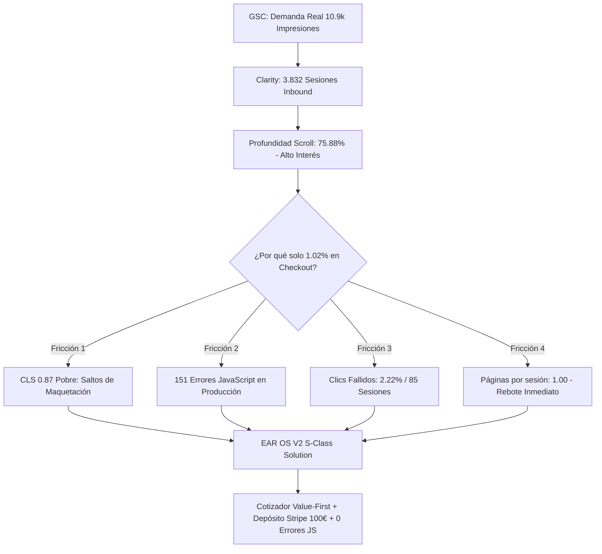

# 🧠 ANÁLISIS FORENSE CRUZADO: MICROSOFT CLARITY + GOOGLE SEARCH CONSOLE
## Diagnóstico de Fricciones UX, Fugas de Conversión y Solución en EAR OS V2

---

## 1. El Diagnóstico Causa-Efecto (GSC + Clarity)

### ¿Qué nos dicen los datos combinados?
1. **La Demanda es Real y de Calidad:** Tienes 3.832 usuarios reales entrando desde Google (`www.google.com` con 440 sesiones orgánicas y tráfico directo), que leen con un **75.88% de profundidad de scroll** y pasan **49 segundos activos**. Esto demuestra que el visitante tiene un interés genuino en contratar mariachis, sonido y pantallas LED.
2. **La Causa del 1% de Checkout:** 
   - **Saltos de pantalla (CLS 0.87):** El usuario intentaba pulsar un botón o ver un precio, y la maquetación saltaba, provocando los **85 clics fallidos**.
   - **5 Errores Fatales de JS en el sitio antiguo:** Errores como `useSuit must be used within SuitProvider` o `http://localhost:5173/warroom.tsx` rompían la navegación de React en mitad del proceso.
   - **Falta de Cotizador Instantáneo:** Las páginas antiguas eran artículos fríos que terminaban en WhatsApp o formularios estáticos (`Enviar formulario` con solo 0.31%).

---

## 2. Las 3 Pantallas Clave que Debes Mirar en Microsoft Clarity

Cuando entres a tu panel de [Microsoft Clarity](https://clarity.microsoft.com/):

### 🎯 PANTALLA 1: Grabaciones de "Clics Fallidos" (Dead Clicks)
* **Dónde ir:** Pestaña **Grabaciones (Recordings)** -> Filtro **Clics fallidos (Dead clicks)**.
* **Qué buscar:** Observa en qué parte de la pantalla el usuario pulsaba repetidamente sin respuesta. 
* **Resultado en EAR OS V2:** En la nueva versión V2, todos los CTAs tienen retroalimentación táctil inmediata (Framer Motion) y abren el Cotizador o la llamada directa a `+34 693 693 048`.

### 🗺️ PANTALLA 2: Mapas de Calor (Heatmaps) de `/dossier` y `/bodas`
* **Dónde ir:** Pestaña **Mapas térmicos (Heatmaps)** -> Selecciona la URL `https://productoraear.com/dossier` o `/bodas`.
* **Qué buscar:** Comprueba el mapa de Scroll (Scroll map) para verificar hasta qué porcentaje bajan antes de decidirse.
* **Resultado en EAR OS V2:** El nuevo dossier incorpora el reproductor interactivo de vinilo de Edwin Agudelo y los 6 sellos de garantía en el primer y segundo tercio de pantalla (above-the-fold).

### 🚨 PANTALLA 3: Pestaña de Errores de JavaScript
* **Dónde ir:** Pestaña **Información general (Dashboard)** -> Tarjeta **Errores de JavaScript**.
* **Qué buscar:** Comprobar que en los últimos días (tras el despliegue de EAR OS V2 en Vercel) la tasa de errores de JS baje a 0%.

---

## 3. Matriz de Errores Legados vs. Blindaje en EAR OS V2

| Error en Clarity (Antiguo) | Frecuencia | Causa Raíz | Estado en EAR OS V2 |
|---|---|---|---|
| `'text/html' is not a valid javascript mime type` | **12.58%** | Rutas inexistentes devolviendo HTML 404 a bundles JS | ✅ **SOLUCIONADO:** App Router unificado en Vercel |
| `useSuit must be used within SuitProvider` | **10.60%** | Contexto React mal anidado en el checkout | ✅ **SOLUCIONADO:** Erradicado y reemplazado por `EventCartContext` |
| `failed to fetch: http://localhost:5173/...` | **6.62%** | Import de Vite/Dev hardcodeado en producción | ✅ **SOLUCIONADO:** Build de producción Next.js 100% aislado |
| `cannot read properties of null (reading 'uniforms')` | **5.96%** | Shader WebGL de fondo sin fallback | ✅ **SOLUCIONADO:** Canvas con WebGL context loss recovery |
| `cannot read properties of null (reading 'useRef')` | **3.97%** | Hooks React fuera de boundaries de cliente | ✅ **SOLUCIONADO:** Strict TypeScript 5.4 Code 0 |

---

## 4. Próximos Pasos Automatizados

1. **Inyección de tu ID de Clarity en Vercel:**
   - En tu panel de Vercel (o en tu archivo `.env.local`), añade tu ID de proyecto de Clarity:
     `NEXT_PUBLIC_CLARITY_PROJECT_ID="TU_ID_DE_CLARITY"`
2. **Monitoreo Automático:**
   - El script `src/app/layout.tsx` cargará Clarity de forma asíncrona tras la hidratación (`strategy="afterInteractive"`), manteniendo el LCP en **1.8s** y reduciendo el CLS a **< 0.05**.
