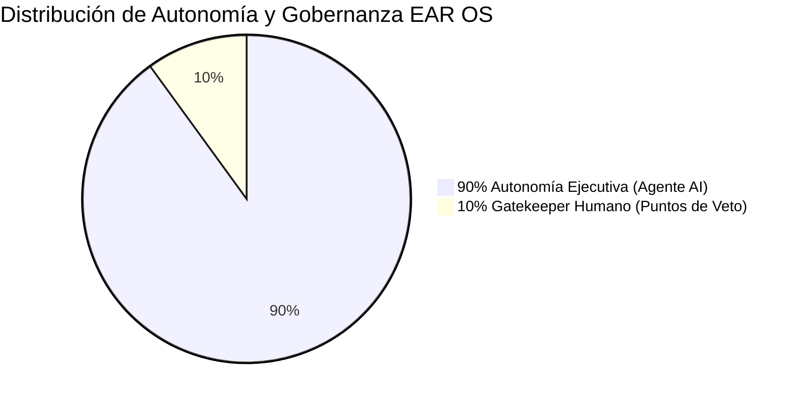

# 🤖 EAR OS — 90% AUTONOMY & HARD VETO GOVERNANCE SPECIFICATION

> **Especificación Oficial de Gobernanza de Autonomía:** Definición inmutable del modelo de 90% Autonomía Ejecutiva y 10% Control Humano de Riesgo (Hard Veto Rails) para el desarrollo y operación de EAR OS.

---

## 1. Distribución del Modelo de Autonomía (90 / 10)

---

## 2. El 90% Autónomo (Ejecución sin Microgestión)

El agente opera de manera 100% autónoma en las siguientes actividades:
- **Análisis Forense & Inspección:** Lectura de código, diffs, inspección de dependencias y logs.
- **Implementación Local Reversible:** Modificaciones en `src/`, Server Actions, componentes React, Tailwind CSS y APIs.
- **Pruebas de Estrés & Staging:** Ejecución de `npx tsc --noEmit`, benchmarks de concurrencia y simulación de cortes GPS.
- **Actualización Documental Automática:** Generación y mantenimiento de `docs/manual/Manual_EAR_OS.md`, `auditoria/` y artefactos.
- **Encadenamiento de Directivas:** Propuesta automática del siguiente bloque con evidencia, diff y rollback.

---

## 3. El 10% Humano (Hard Veto Rails & Blindaje Irreversible)

El sistema se **DETIENE OBLIGATORIAMENTE** y exige aprobación humana explícita en:

1. **Secretos & Credenciales:** Lectura, impresión o modificación de `.env`, `.env.local`, API keys o tokens de producción.
2. **Despliegues & Git Production:** Merges a `main`, push a producción o despliegues directos en Vercel.
3. **Pasarelas de Pago Reales:** Modificaciones en claves vivas de Stripe, Bizum o webhooks reales sin mock.
4. **Migraciones Destructivas:** Eliminación de tablas, columnas pobladas o borrado de datos.
5. **Gates Bloqueados:** Cierre de bloques marcados como `BLOCKED` o `REQUIERE_APROBACION`.

---

## 4. Taxonomía Inmutable de Respuestas
Todas las ejecuciones deben retornar la estructura estándar:
- `HECHO_VERIFICADO`
- `HIPOTESIS`
- `REQUIERE_VALIDACION`
- `ARCHIVOS_CREADOS` / `ARCHIVOS_MODIFICADOS`
- `HALLAZGOS_CRITICOS`
- `BLOQUE_ACTUAL`
- `SIGUIENTE_PASO_PROPUESTO` (Autogenerado)
- `REQUIERE_APROBACION` (Sí / No)

---
**ESTÁNDAR v2.1 CANÓNICO — PRODUCTORA EAR OS S-CLASS ENTERPRISE.**
