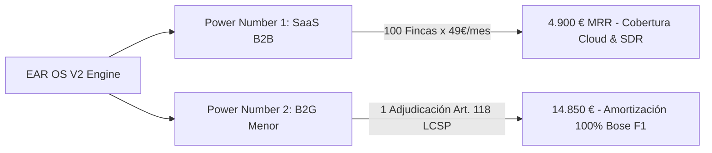
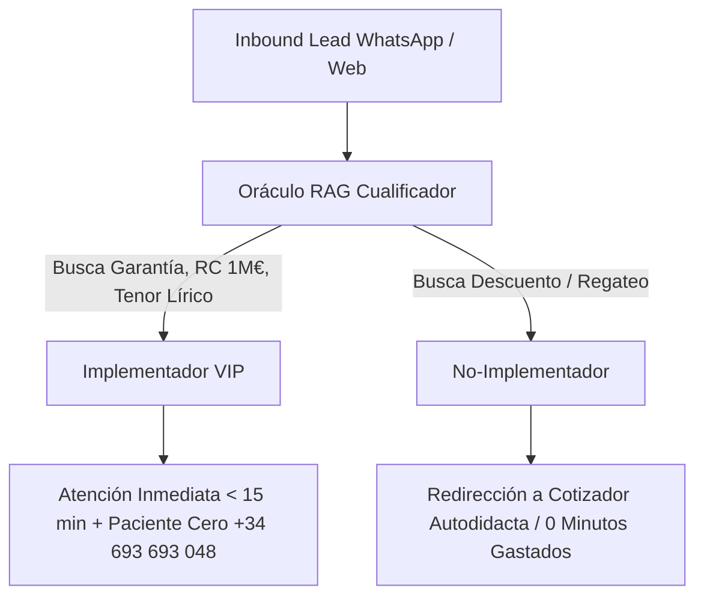

# 💎 INCUBADORA DESPEGUE: POWER NUMBERS™ & FILTRO DE IMPLEMENTADOR (S-CLASS)
## Directiva de Gobernanza Comercial & Filtro de Energía — EAR OS V2

> **Tesis Inmutable:** El Paciente Cero no persigue métricas de vanidad ni regateos informales. La infraestructura de EAR OS V2 está diseñada para calificar y canalizar únicamente a **Implementadores de Alto Valor** hacia los dos **Power Numbers™** de liberación comercial.

---

## 1. Los 2 Power Numbers™ de Liberación Comercial

### Power Number 1 (SaaS B2B Directores de Espacios & Fincas)
* **Meta Operativa:** 100 Fincas / Proveedores Homologados $\times$ 49 €/mes = **4.900 € MRR**.
* **Propósito:** Financia el 100% de los costes fijos de infraestructura (Vercel Pro, Supabase Enterprise, APIs vectoriales de IA, Stripe Live) y asegura la retención del SDR comercial.
* **Métrica de Calidad:** No se persigue el volumen disperso, sino la activación de enclaves con alta rotación de bodas y galas corporativas.

### Power Number 2 (Contratos Menores B2G Art. 118 LCSP)
* **Meta Operativa:** 1 Adjudicación Pública por trimestre = **13.500 € a 14.850 €** (Justo bajo el umbral legal de 14.999 €).
* **Propósito:** Financia la adquisición, renovación y amortización de los arrays Bose F1 Model 812 y microfonía Shure Axient Digital sin recurrir a deuda bancaria.
* **Métrica de Calidad:** Generación de memorias técnicas visadas en < 24 horas a través del protocolo **Nodo Art. 118 LCSP**.

---

## 2. El Filtro de Implementador (Alexandra / Amber)

### Regla de Oro de Cualificación Agéntica:
* **Comprador Implementador (High-Ticket):** Valora la tranquilidad de los novios, la acústica calibrada (12 W/pax), la póliza de 1.000.000 € y la presencia escénica del tenor Edwin Agudelo. Recibe dossier RAG inmediato y llamada prioritaria.
* **No-Implementador (Buscador de Descuentos):** Intenta regatear la tarifa base. El bot activa el reencuadre del *Costo del Fallo / Inercia* y lo redirige al cotizador interactivo para no consumir la energía ni el tiempo del Paciente Cero.

---

## 3. Estándar de Suficiencia vs. Lo Necesario

| Dimensión | Lo "Necesario" (Competencia Informal) | Lo "Suficiente" (Estándar EAR OS S-Class) |
|---|---|---|
| **Presupuesto** | Texto plano por WhatsApp o email frío | Dossier RAG interactivo con SHA-256 Price-Lock |
| **Prueba Artística** | Enlace roto de YouTube | Bóveda Sonora S-Class con 4 tracks inéditos |
| **Sonorización** | Altavoces domésticos con riesgo de acople | Bose F1 / L-Acoustics calibrado a 12 W/pax |
| **Legalidad** | Sin alta ni seguro de RC | Póliza de 1.000.000 € y cumplimiento OPCAT |
| **Reserva** | Transferencia informal sin recibo | Custodia de depósito en Stripe Live Escrow |

---

## 4. Guía de Despliegue en Vercel & Actualización de Sitemap

### 4.1 Despliegue en Vercel
1. Los cambios están listos para ser desplegados en producción mediante Git push.
2. Al ejecutar el push a la rama principal (`main`), Vercel compila Next.js 14 en modo estricto y despliega los Edge Boundaries.

### 4.2 Actualización del Sitemap en Google Search Console
1. El sitemap canónico dinámico se sirve en:
   `https://www.productoraear.com/sitemap.xml`
2. El archivo [`src/app/robots.ts`](file:///C:/EAR_OS_V2/src/app/robots.ts) apunta directamente a esta URL.
3. Para forzar la re-indexación tras el despliegue:
   - Entra en **Google Search Console** -> Pestaña **Sitemaps**.
   - Ingresa `sitemap.xml` y pulsa **Enviar / Actualizar**.
   - Google procesará las 100+ nuevas URLs relacionales y los pilares canónicos saneados.
