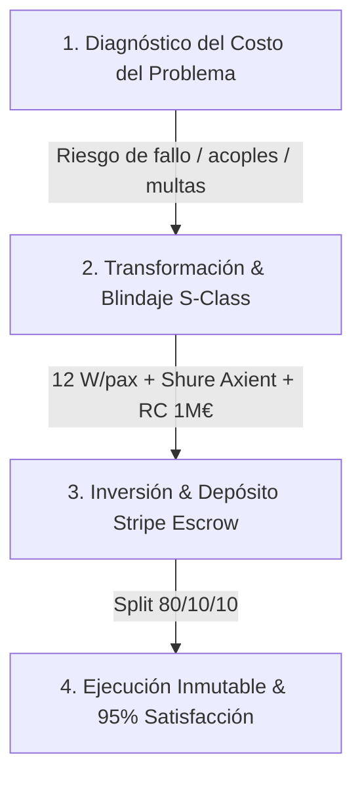

# 🏛️ VALUE-FIRST PRICING & OBJECTION DISARM ENGINE (S-CLASS)
## Directiva de Reencuadre de Valor — Incubadora Despegue / Midas / Antigravity Omega

> **Principio Inmutable de Elevación:** Nunca mostrar la tarifa final sin antes desglosar el **Costo de la Inercia (CDI)**, el **Riesgo Evitado** y la **Transformación Técnica** que garantizan el éxito del evento.

---

## 1. La Secuencia de 3 Fases (The 3-Phase Value Shift)

### Fase 1: El Costo del Problema (Risk Staging)
- **Pregunta Disparadora:** "¿Cuánto cuesta que el sonido falle en el momento del 'Sí, quiero', que los micrófonos acoplen o que la policía municipal suspenda el evento por exceso de decibelios?"
- **Badges de Blindaje en UI:**
  1. *Protección Acústica 12 W/pax:* Cobertura homogénea Bose F1 sin fatiga auditiva.
  2. *Cumplimiento Normativo Local:* Cero multas, respeto a la ordenanza municipal (OPCAT 85 dBA).
  3. *Seguro de Responsabilidad Civil de 1.000.000 €:* Cobertura integral para fincas protegidas y recintos públicos.
  4. *Microfonía Shure Axient Digital:* Cero interferencias RF ni cortes durante los discursos o la ceremonia.

### Fase 2: La Transformación & Garantía (The Shift)
- **Comparativa Directa (El Antes vs. El Después):**
  - *Opción Amateur / Low-Cost:* Músicos sin rider homologado, acoples inesperados, descontrol de decibelios, estrés e incertidumbre.
  - *Estándar Productora EAR (S-Class):* Tenor lírico de gala (Edwin Agudelo), trajes bordados a mano con botonadura de plata, puntualidad militar (llegada T-120 min) y satisfacción auditada del 95%.

### Fase 3: La Inversión & Reserva (Price Landing)
- La cifra no se presenta como un "gasto", sino como un "seguro de tranquilidad y emoción inolvidable".
- Desglose transparente con el **Split Soberano 80/10/10** (80% Artista / 10% Infraestructura EAR OS / 10% VIMUME Tercera Edad).
- Depósito de garantía (100€ / 0.50€) procesado vía Stripe Live Escrow con reembolso garantizado ante cancelaciones >30 días.

---

## 2. Nodos Cognitivos RAG Inyectados (`src/data/ear-rag-database.json`)

1. **`OBJ-PRICE-01` (Reencuadre 'Está Caro'):**
   - No existe nada más caro que un servicio barato que arruine un momento irrepetible. La diferencia de precio es la prima de seguro de un evento impecable.
2. **`OBJ-PRICE-02` (Diferenciación vs. Músicos Low-Cost):**
   - Comparación de afinación lírica, trajes charros bordados a mano con botonadura de plata artesanal frente a trajes alquilados, y microfonía Shure Axient Digital.
3. **`OBJ-PRICE-03` (Exclusividad & Bloqueo Inmutable):**
   - Política estricta de cero doble bolo simultáneo: 1 solo evento por tramo horario para dedicar el 100% de atención y rigor técnico.
4. **`FRAMEWORK-INCUBADORA-DESPEGUE-01`:**
   - Estructura metodológica oficial de reencuadre en 3 fases para el Cotizador, WhatsApp Bots y llamadas del Paciente Cero (+34 693 693 048).

---

## 3. Puntos de Contacto Actualizados

- **Cotizador S-Class:** [`src/features/finance/ui/MultiPricer.tsx`](file:///C:/EAR_OS_V2/src/features/finance/ui/MultiPricer.tsx).
- **Consola del Paciente Cero:** [`src/app/(dashboard)/dashboard/paciente-cero/page.tsx`](file:///C:/EAR_OS_V2/src/app/(dashboard)/dashboard/paciente-cero/page.tsx).
- **Base Cognitiva RAG:** [`src/data/ear-rag-database.json`](file:///C:/EAR_OS_V2/src/data/ear-rag-database.json).
- **Motor Semántico Relacional:** [`src/lib/seo/semantic-engine.ts`](file:///C:/EAR_OS_V2/src/lib/seo/semantic-engine.ts).
