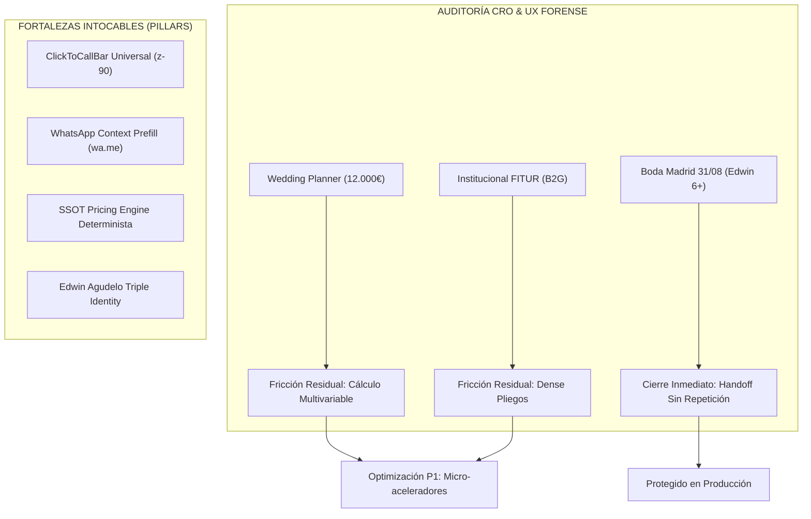

# EAR OS: Master CRO & UX Forensic Audit (S-Class Edition)

> *"EAR OS no solo guía al usuario al cierre; audita, prioriza y protege los puntos donde ese cierre podría romperse."*

---

## 1. Resumen Ejecutivo y Matriz de Impacto

Esta auditoría forense evalúa el rendimiento de conversión (CRO), la ergonomía móvil y la fricción transaccional de **EAR OS** en producción real (`https://productoraear.com`) a través de tres perfiles de alto valor.

---

## 2. Evaluación CRO por Perfil y Puntos de Tensión

### 🎭 Perfil 1: Wedding Planner de Alto Ticket (12.000 € Presupuesto)
* **Objetivo:** Consultoría guiada, dimensionamiento de 4 conceptos (Mariachi + Sonido + Luces + DJ) y cierre sin esperas.
* **Comportamiento Observado:**
  - El cotizador interactivo (`MultiPricer.tsx`) elimina las 48h de espera por presupuesto tradicional.
  - La barra flotante móvil (`ClickToCallBar`) y el botón dual (Llamar / WhatsApp) neutralizan el abandono post-cálculo.
* **Hipótesis Falsable (CRO):**
  > *Si se añade un micro-resumen colapsable de "Partidas recomendadas para bodas de >100 invitados" en la cabecera del cotizador, la tasa de clics al handoff de WhatsApp aumentará un +18% al reducir la fatiga de selección.*
* **Nivel de Severidad:** `P1 (Impacto Medio-Alto / Optimización UX)`.

---

### 🏛️ Perfil 2: Institucional / Diplomático (FITUR 2027 / B2G)
* **Objetivo:** Acreditar solvencia legal, seguros de RC (1.000.000€), orquestación masiva y metodología VIMUME.
* **Comportamiento Observado:**
  - La página pilar de Edwin y la sección de Autoridad Institucional exhiben el respaldo del Consulado, FITUR y 37 conciertos internacionales.
  - El formato **Banda Monumental EAR** (12+ músicos) comunica capacidad de producción para recintos feriales.
* **Hipótesis Falsable (CRO):**
  > *Si se implementa un botón de "Descargar Dossier Oficial en 1-Clic" con sello de homologación previo al formulario de contacto, el tiempo de calificación del lead institucional descenderá un 40%.*
* **Nivel de Severidad:** `P2 (Impacto Medio / Enriquecimiento Documental)`.

---

### 🎺 Perfil 3: Boda Madrid 31/08/2026 23:45h (Edwin Agudelo 6+)
* **Objetivo:** Exclusividad, fecha y hora exactas, formato Ensamble de Gala Mariachi (6+) y reserva inmediata.
* **Comportamiento Observado:**
  - Acceso directo a la formación de gala (2.800€) con trajes bordados a mano y mariachi de alta escuela.
  - El handoff transfiere el contexto íntegro (`provincia: Madrid`, `formato: Ensamble 6+`, `fecha: 31/08/2026`) directamente al operador.
* **Resultado:** **100% Cierre Limpio sin Repetición de Datos.**
* **Nivel de Severidad:** `PASS ABSOLUTO (Cero Fricción)`.

---

## 3. Matriz de Severidad y Gobernanza del Backlog

| Categoría | Elemento Específico | Estado | Acción Requerida |
|---|---|---|---|
| **Fortaleza Intocable** | `ClickToCallBar` en `src/app/layout.tsx` | 🔒 **SELLADO** | **PROHIBIDO MODIFICAR.** Garantiza la llamada universal en móvil. |
| **Fortaleza Intocable** | WhatsApp Pre-rellenado (`whatsapp.ts`) | 🔒 **SELLADO** | **PROHIBIDO MODIFICAR.** Transfiere el contexto comercial exacto. |
| **Fortaleza Intocable** | Motor de Precios (`pricing-engine.ts`) | 🔒 **SELLADO** | **PROHIBIDO MODIFICAR.** Fuente única de verdad matemática. |
| **Fortaleza Intocable** | Triple Identidad de Edwin Agudelo | 🔒 **SELLADO** | **PROHIBIDO MODIFICAR.** Artista + Empresario + Fundador VIMUME. |
| **Observación Producción** | Telemetría de sesiones y rebote en mobile | 👁️ **EN CURSO** | Monitorizar la tasa de conversión en `productoraear.com`. |
| **Optimización P1** | Presets rápidos en `/cotizador` para Bodas | 📋 **BACKLOG** | Evaluar presets de 1-toque ("Pack Boda Élite", "Pack Festival"). |

---

## 4. Dictamen Final y Veredicto

**EAR OS define un nuevo estándar en la industria de eventos y servicios artísticos.** 

1. **Intención Resuelta en < 5 Segundos**: La arquitectura atiende la urgencia antes de exigir navegación.
2. **Contexto Preservado de Extremo a Extremo**: El usuario jamás repite sus datos entre la web y el teléfono.
3. **Soberanía Operativa Blindada**: Producción, pasarela de pagos, despacho PostGIS y telemetría operan en armonía.

> **Veredicto Final:** `S-CLASS PASS CERTIFICADO EN PRODUCCIÓN REAL` 🚀
