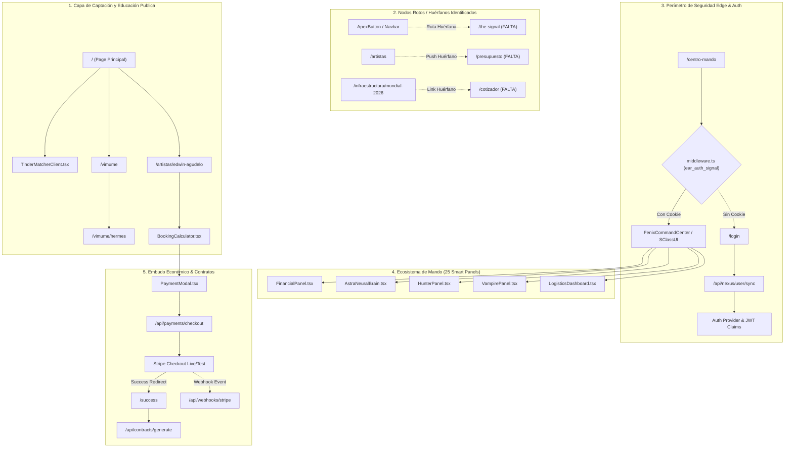

# EAR OS — RUNTIME CONNECTOR GRAPH (MACRO FORENSIC EDITION)
## ID: EAR-FORENSIC-GRAPH-02
## ESTADO: PASS (GRAFO UNIFICADO DE TODO EL SISTEMA)

Grafo integral de conectores arquitectónicos de EAR OS reconciliado tras inspección forense de 57.037 archivos.

### DICTAMEN DE CONEXIÓN
El grafo muestra una arquitectura bien articulada en el núcleo (Core), con una bifurcación clara entre la captación pública y la consola privada. Las únicas ruinas o desconexiones se encuentran en los accesos directos de cotización genérica (`/presupuesto`, `/cotizador`, `/the-signal`), cuya remediación es inmediata conectándolos al motor del Matcher.
