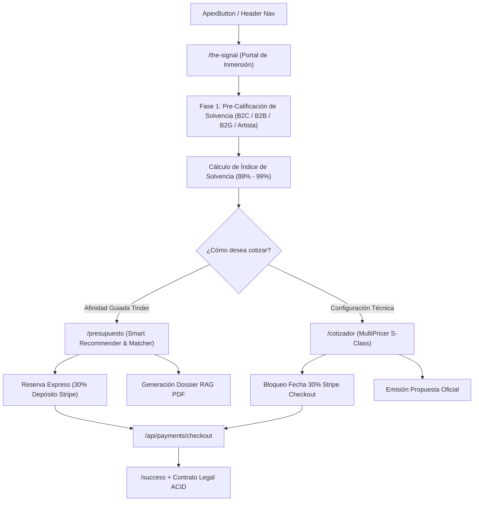

# EAR OS — SIGNAL FUNNEL ARCHITECTURE & PRE-QUALIFICATION
## ID: EAR-SSOT-SIGNAL-FUNNEL-01
## ESTADO: HECHO_VERIFICADO

Arquitectura del embudo de alta conversión The Signal y su integración con los túneles transaccionales de EAR OS.

---

### 1. MAPA DEL EMBUDO S-CLASS

---

### 2. PROTOCOLOS DE SEGREGACIÓN POR ROL EN THE SIGNAL
- **Particular VIP / Bodas (B2C)**: Canalizado prioritariamente a `/presupuesto` para selección de repertorio, violines y mariachi de gala.
- **Empresas & Convenciones (B2B)**: Acceso al cotizador desglosado con IVA, factura deducible y seguro RC.
- **Ayuntamientos & Sector Público (B2G)**: Acceso a fichas de licitación, homologación de escenarios y riders L-Acoustics.
- **Artistas & Curadores**: Puerta de onboarding para audición de entrada al roster S-Class.
