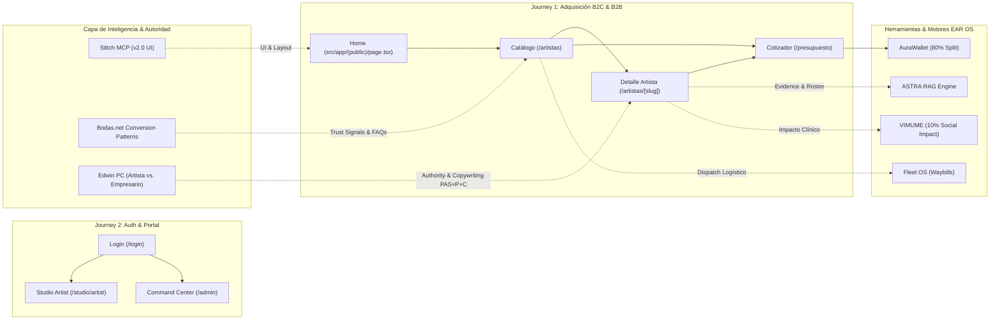

# 🕸️ EAR OS MASTER FLOW GRAPH — NAVEGACIÓN, LÓGICA Y COHERENCIA DE SISTEMA (SSOT)

> **SSOT de Arquitectura de Producto:** Grafo maestro de 10 capas que modela EAR OS como un sistema total de flujos dirigidos por estado, cruzando Inteligencia UX (Bodas.net), Inteligencia de Identidad (PC Edwin Agudelo) y las Herramientas del Ecosistema EAR OS.

---

## 1. Flowchart Maestro de Arquitectura & Transiciones (Mermaid)

---

## 2. Definición Estructural de Pantallas & Matriz Anti-Colisión

| Path Expuesto | Ruta Real App Router | Layout / Route Group | Propósito | Entradas | Salidas CTAs | Herramienta EAR OS | Fallback / Loading | Estado Bloque |
|---|---|---|---|---|---|---|---|---|
| `/` | `src/app/(public)/page.tsx` | `(public)/layout.tsx` | Showcase & Captación | Directo / Logo | `/artistas`, `/presupuesto`, `/login` | STITCH UX | SSG Prerender | `LIVE` (`● Ready`) |
| `/artistas` | `src/app/(public)/artistas/page.tsx` | `(public)/layout.tsx` | Catálogo & Filtros | Home, Header | `/artistas/[slug]`, `/presupuesto` | Roster Verificado (35k) | `loading.tsx` skeleton | `PREVIEW` (`● Ready`) |
| `/artistas/[slug]` | `src/app/(public)/artistas/[slug]/page.tsx` | `(public)/layout.tsx` | Convicción & Showreel | `/artistas`, Home | `/artistas/[slug]/booking`, `/presupuesto` | ARTIST_MASTER_PROFILE | `notFound()` -> `not-found.tsx` | `BLOCKED` (Step 1.3) |
| `/presupuesto` | `src/app/(public)/presupuesto/page.tsx` | `(public)/layout.tsx` | Cotizador Predictivo | `/`, `/artistas`, Detalle | `/success`, `/login` | ASTRA RAG Engine | Form fallback | `PLANNED` |

---

## 3. Condiciones Exactas para Desbloquear Step 1.3 (`/artistas/[slug]`)

> [!IMPORTANT]
> **Condiciones de Desbloqueo (Gates):**
> 1. **Gate Visual Step 1.2:** Aprobación explícita del usuario sobre el Preview Deployment `● Ready` de `/artistas` (`ear-a4dj7zgl8`).
> 2. **Gate de Conectividad:** Comprobación de enlaces cruzados sin dead-links.
> 3. **Gate de Fallback:** Garantía de que `src/app/(public)/artistas/[slug]/page.tsx` invoque `notFound()` cuando el artista no exista.
> 4. **Gate Anti-Colisión:** Garantía de que no exista ninguna carpeta `src/app/artistas/[slug]` paralela fuera del Route Group `(public)`.

---

## 4. Dictamen de Readiness del MVP
- **Dictamen Actual:** `READY_FOR_PREVIEW` / `HOLD_FOR_PRODUCTION_GATE`
- **Producción:** Bloqueada.
