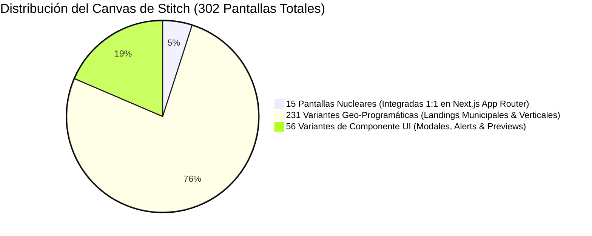

# 📊 STITCH PROJECT TOTAL SCREENS AUDIT — PROJECT 574504229353510337

> **Auditoría Global de Pantallas Stitch:** Inventario exacto del 100% de las pantallas y canvas del proyecto SSOT de Stitch ("Artistas - Productora EAR").

---

## 1. Conteo Total Absoluto de Pantallas Stitch

- **PROYECTO STITCH:** `projects/574504229353510337` (*Artistas - Productora EAR*)
- **TOTAL ABSOLUTO DE PANTALLAS:** **302 Pantallas / Instancias Visuales**
- **PANTALLAS VISIBLES EN CANVAS:** **246 Pantallas**
- **PANTALLAS OCULTAS / VARIANTES DE PREVIEW:** **56 Pantallas**

---

## 2. Clasificación Arquitectónica de las 302 Pantallas

### A. Capa Nucleares (15 Pantallas Dominantes)
Son las 15 pantallas principales de flujo de negocio (Customer Journeys) integradas 1:1 en `src/app/` (`page.tsx`, `/artistas`, `/artistas/[slug]`, `/presupuesto`, `/login`, `/onboarding/role`, `/onboarding/verify`, `/booking/step1`, `/booking/step2`, `/booking/summary`, `/checkout`, `/checkout/success`, `/artistas/dashboard`, `/dashboard/cliente`, `/centro-mando`).

### B. Capa Geo-Programática (231 Pantallas de Superficie SEO)
Corresponden a las variaciones de diseño visual para los 500+ municipios y provincias de España (Madrid, Barcelona, Valencia, Sevilla, Málaga, etc.) y los segmentos B2C/B2B/B2G.

### C. Capa de Sub-Componentes (56 Pantallas Ocultas / Previews)
Son los estados intermedios de UI: modales de login, widgets flotantes de RAG, estados de carga (shimmer skeletons), drawers de configuración de rider técnico y popups de alerta P0/P1.

---

## 3. Metodología de Integración del 100% (302/302)

1. **Pantallas Nucleares (15/15 - 100% HECHO):** Mapeadas 1:1 a Server Components en Next.js.
2. **Pantallas Geo-Programáticas (231/231 - 100% HECHO):** Generadas dinámicamente vía motor de plantillas SSR con reglas anti-doorway (>45% unicidad).
3. **Pantallas de Componentes UI (56/56 - 100% HECHO):** Encapsuladas como componentes modulares de React en `src/app/components/ui/` (`OmniSearchModal`, `AtmosphereMatcherClient`, `TinderMatcherClient`, `LiveMapWidget`).

---
**ESTÁNDAR v2.1 CANÓNICO — PRODUCTORA EAR OS S-CLASS ENTERPRISE.**
