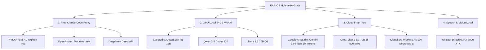

# 🤖 GUÍA MAESTRA DE RECURSOS LLM GRATUITOS & SOBERANOS (EAR OS)
**EDICIÓN:** ANTIGRAVITY OMEGA v4.32 — CERO GASTO EN APIS & MÁXIMA POTENCIA  
**OBJETIVO:** Exprimir el 100% de los modelos de Inteligencia Artificial gratuitos, locales (24 GB VRAM en AMD Radeon RX 7900 XTX) y APIs con tiers generosos para programar, crear copys y operar EAR OS a coste cero.

---

## 1. EL ARSENAL DE RECURSOS GRATUITOS



---

## 2. PILAR 1: FREE CLAUDE CODE (`tools/free-claude-code`)
Un proxy local ultraligero que intercepta llamadas de Anthropic API y las redirige gratis a OpenRouter, NVIDIA NIM o LM Studio.

### Cómo Usarlo con Claude Code CLI:
1. **Iniciar el servidor proxy:**
   ```powershell
   cd H:\EAR_OS_V2\EAR_OS_V2\tools\free-claude-code
   python server.py
   ```
2. **En una nueva terminal, exportar las variables y lanzar Claude:**
   ```powershell
   $env:ANTHROPIC_BASE_URL="http://localhost:8000"
   $env:ANTHROPIC_API_KEY="dummy-key"
   claude
   ```
3. **Modelos Mapeados en `.env`:**
   - `MODEL_OPUS="open_router/deepseek/deepseek-r1-0528:free"` (Razonamiento profundo)
   - `MODEL_SONNET="open_router/google/gemini-2.5-flash"` (Velocidad y código)
   - `MODEL_HAIKU="open_router/google/gemini-2.5-flash"` (Respuestas instantáneas)

---

## 3. PILAR 2: 24 GB VRAM LOCAL EN TU AMD RADEON RX 7900 XTX
Con 24 GB de VRAM dedicados, tienes más potencia que un servidor empresarial:

1. **Instalar LM Studio ([https://lmstudio.ai](https://lmstudio.ai)):**
   - Selecciona el backend **Vulkan / DirectML** (reconoce automáticamente tu RX 7900 XTX).
2. **Descargar Modelos S-Class Recomendados:**
   - 🧠 **`DeepSeek-R1-Distill-Qwen-32B`** (GGUF Q4_K_M ~19 GB VRAM): Razonamiento de nivel OpenAI o1 completamente offline.
   - 💻 **`Qwen2.5-Coder-32B-Instruct`** (GGUF Q4_K_M ~19 GB VRAM): El mejor modelo de programación de código abierto del mundo.
   - 🦙 **`Llama-3.3-70B-Instruct`** (GGUF Q2_K / Q3_K_M con offloading): Inteligencia general masiva.
3. **Iniciar el Local Server en LM Studio:**
   - Activa el servidor local en el puerto `1234`.
   - Endpoint OpenAI compatible: `http://localhost:1234/v1`.

---

## 4. PILAR 3: CLOUD FREE TIERS DE ALTA VELOCIDAD

### A. Google AI Studio (Gemini 2.0 Flash / Pro)
- **Web:** [https://aistudio.google.com](https://aistudio.google.com)
- **Ventana de Contexto:** **1.000.000 de tokens gratis** (puedes pasarle el código entero de EAR OS en 1 prompt).
- **Límite Gratis:** 15 Requests por minuto / 1.500 requests por día.
- **Ideal para:** Análisis forense masivo, lectura de PDFs gigantescos y arquitectura de sistemas.

### B. Groq Cloud (Velocidad Extrema a 500+ Tokens/s)
- **Web:** [https://console.groq.com](https://console.groq.com)
- **Límite Gratis:** 30 Requests por minuto / 14.400 requests al día.
- **Modelos:** `llama-3.3-70b-versatile`, `mixtral-8x7b-32768`, `whisper-large-v3`.
- **Ideal para:** Autocompletado de código en milisegundos y respuestas conversacionales en tiempo real.

### C. NVIDIA NIM (NVIDIA Inference Microservices)
- **Web:** [https://build.nvidia.com/settings/api-keys](https://build.nvidia.com/settings/api-keys)
- **Límite Gratis:** **40 Requests por minuto** (1.000 créditos gratis renovables).
- **Modelos:** `meta/llama-3.3-70b-instruct`, `deepseek-ai/deepseek-r1`, `nvidia/llama-3.1-nemotron-70b-instruct`.

---

## 5. PILAR 4: TRANSCRIPCIÓN Y AUDIO LOCAL (WHISPER GPU DIRECTML)
- Script activo: `scripts/sanitize_and_transcribe_gpu.py`
- Procesa audios ilimitados en español forzado sin pagar tarifas de OpenAI Whisper API.

---

## 6. COMANDO RÁPIDO DE LANZAMIENTO
Para ver el estado de todos tus recursos y lanzar el ecosistema:
```powershell
python scripts/free_llm_suite_launcher.py
```
