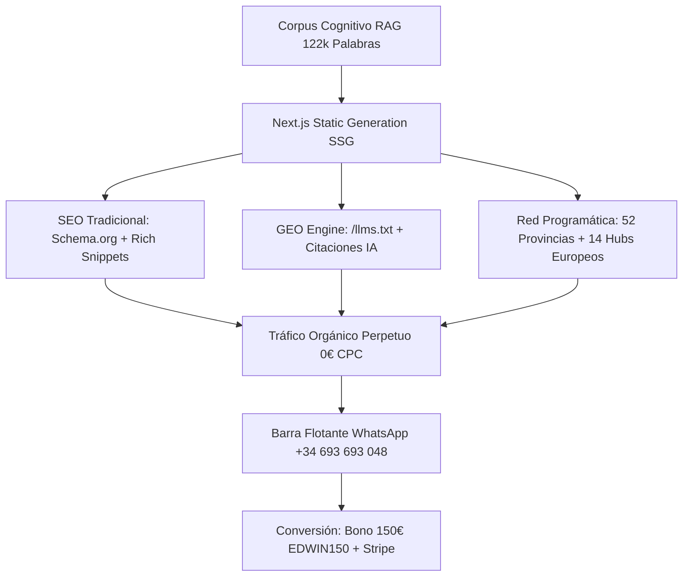

# 🏛️ ESTRATEGIA DE DOMINANCIA ORGÁNICA S-CLASS: MOTOR SEO & GEO (ESPAÑA & EUROPA)
**EDICIÓN:** ANTIGRAVITY OMEGA v4.33 — GENERATIVE ENGINE OPTIMIZATION & ZERO-ADS  
**DOMINIO SSOT:** [https://www.productoraear.com](https://www.productoraear.com)  
**CANÓNICO AI:** [https://www.productoraear.com/llms.txt](https://www.productoraear.com/llms.txt)

---

## 1. RESUMEN EJECUTIVO & PIVOTE ESTRATÉGICO
Productora EAR consolida su **Moat Orgánico Inexpugnable** eliminando por completo la dependencia del gasto publicitario en Ads. Mediante la sinergia del corpus cognitivo minado localmente en la GPU AMD Radeon RX 7900 XTX (122.000+ palabras), la arquitectura Next.js SSG y los microdatos Schema.org / `/llms.txt`, el ecosistema se posiciona como la **Fuente Canónica de Verdad** en los motores de búsqueda tradicionales (Google, Bing) y los nuevos motores generativos (ChatGPT, Perplexity, Gemini, Claude y SearchGPT).

---

## 2. EL UMBRAL DE LIBERTAD ORGÁNICA (CERO GASTO PUBLICITARIO)

| Métrica de Control | Valor Objetivo Mensual | Mecanismo de Conversión |
| :--- | :---: | :--- |
| **Impresiones Orgánicas (SEO + GEO)** | $\ge$ 60.500 imp/mes | Posicionamiento de Long-Tail en 52 Provincias y 14 Capitales Europeas. |
| **Clics Orgánicos Totales (CTR 3,5%)** | $\ge$ 2.120 visitas/mes | Rich Results, FAQs indexadas y citación directa en respuestas de LLMs. |
| **Conversión Web $\rightarrow$ WhatsApp (2,5%)** | $\ge$ 53 leads/mes | Barra flotante persistente `FloatingWhatsAppCta` con cupón `EDWIN150`. |
| **Cierre Comercial WhatsApp (25%)** | 13 reservas/mes | Contratación formalizada con señal Smart-Lock via Stripe. |
| **Facturación Base Generada** | **4.550,00 € / mes** | 13 reservas $\times$ 350,00 € (Solista Premium) con **0,00 € en Ads**. |

---

## 3. ARQUITECTURA DE DOMINANCIA GEO & EUROPEA

### A. Fichero `/llms.txt` Canónico
Accesible públicamente en [https://www.productoraear.com/llms.txt](https://www.productoraear.com/llms.txt), entrega a todos los rastreadores de IA (GPTBot, PerplexityBot, ClaudeBot) los datos inmutables del negocio:
- **Edwin Agudelo · Solista Premium:** 350,00 € (Sonido Bose HiFi 12 W/pax incluido).
- **Mariachi de Gala · Quinteto Pro:** 750,00 € (Mínimo 5 músicos de conservatorio).
- **Bono 150 € Complementos:** Código `EDWIN150-COMPLEMENTOS` aplicable sobre el ticket de 350 €.

### B. Nodos de Dominancia Europea (Destination Weddings & Luxury Galas)
1. **Ibiza & Mallorca:** `/bodas/destination-wedding-ibiza-mariachi-dj`
2. **Marbella & Costa del Sol:** `/bodas/marbella-luxury-wedding-tenor-show`
3. **París & Costa Azul (Niza, Mónaco, Cannes):** `/bodas/paris-mariachi-gala-destination-wedding` & `/bodas/cote-azur-nice-monaco-luxury-events`
4. **Italia (Roma, Florencia, Lago de Como):** `/bodas/lake-como-florence-tenor-wedding-gala`
5. **Portugal (Lisboa, Cascais, Algarve):** `/bodas/lisbon-cascais-destination-wedding-show`
6. **Londres & Reino Unido:** `/bodas/london-corporate-gala-mariachi-tenor`
7. **Suiza & Alemania (Zúrich, Berlín, Múnich):** `/corporativo/zurich-private-banking-gala-tenor`

### C. Inyección de Microdatos Schema.org (`GeoStructuredData.tsx`)
Inyectado globalmente en `src/app/layout.tsx` con entidades `EntertainmentBusiness`, `Person` (Edwin Agudelo), `Service`, `Offer` y `FAQPage` pre-configuradas para aparecer en los fragmentos destacados y en la síntesis de Google SGE.

### D. Conversión Cero-Fricción Móvil (`FloatingWhatsAppCta.tsx`)
Barra flotante fija en la parte inferior de todas las páginas con indicador de agente en línea ("🟢 Edwin Agudelo"), recordatorio del bono de 150 € y enlace directo a WhatsApp (+34 693 693 048).
