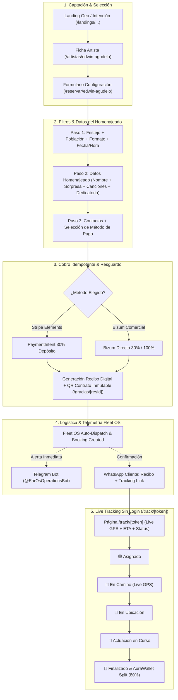

# 🕸️ EAR OS ARTIST SERVICE BOOKING GRAPH (MMD)

> **SSOT de Grafo del Servicio de Reserva & Operaciones:** Flujo Mermaid de alta fidelidad conectando la captación por landing, filtros, formulario del homenajeado, cobro Stripe/Bizum, resguardo y tracking Fleet OS con alertas por WhatsApp/Telegram.

---

## 1. Flowchart del Grafo de Reserva & Operaciones

