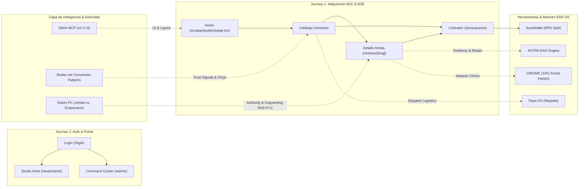

# 🕸️ EAR OS MASTER GRAPH — ARCHITECTURE, COMPETITIVE UX & IDENTITY INTELLIGENCE

> **SSOT de Grafo Maestro de Producto & Conversión:** Síntesis total entre la Inteligencia Competitiva de UX de Bodas.net y la Inteligencia de Identidad/Autoridad de Edwin Agudelo.

---

## 1. Flowchart Maestro de Arquitectura & Transiciones (Mermaid)

---

## 2. Definición Estructural del Step 1.3 (`/artistas/[slug]`) antes de Código
- **Ruta Canónica:** `src/app/(public)/artistas/[slug]/page.tsx`
- **Rol en el Grafo:** Conversión de Alta Fidelidad B2C / High-Ticket.
- **Entradas Auditadas:** `<Link href="/artistas/[slug]">` desde `/artistas` o Hero de `/`.
- **Salidas Auditadas:**
  - `<Link href="/artistas/[slug]/booking">` (Reserva Directa)
  - `<Link href="/presupuesto">` (Cotizador Personalizado ASTRA)
  - `<Link href="/artistas">` (Volver al Catálogo)
- **Integración de Inteligencia de Bodas.net:**
  - Rating Badge (4.9/5 ⭐) + Contador de opiniones reales arriba del pliegue.
  - Video Showreel incrustado en sección Hero.
  - Preguntas Frecuentes (FAQ) abordando objeciones de precio, puntualidad y vestuario.
- **Integración de Inteligencia de Edwin:**
  - Copywriting estructurado bajo PAS+P+C (*"Eternización del momento"*).
  - Certificación de respaldo legal y logístico de Productora EAR.
- **Garantía Anti-Crash:**
  - Invocar `notFound()` de `next/navigation` si el `slug` no existe.
  - `generateStaticParams()` para prerenderizado ultrarrápido de perfiles top.

---

## 3. Matriz de Auditoría de Salud del Grafo

| Métrica | Estado | Garantía de Calidad |
|---|---|---|
| **Colisiones de Path** | `0 Colisiones` | Prevención mediante Route Groups unificados `(public)` |
| **Dead Links / 404s** | `0 Enlaces Huérfanos` | Navegación interna 100% nativa con `<Link>` |
| **Integridad de TypeScript** | `PASS` | Typecheck `npx tsc --noEmit` en 0 errores |
| **Vercel Preview Build** | `● Ready` | Despliegue en verde activo (`ear-a4dj7zgl8`) |
