# ⚡ EAR OS — DYNAMIC CONTRACTING, IDEMPOTENT PAYMENTS & FRICTIONLESS TRACKING ENGINE

> **SSOT de Arquitectura de Contratación Dinámica:** Flujo completo de conversión sin fricción (Contexto ➔ Cálculo ➔ PaymentIntent Idempotente ➔ Recibo/Contrato ➔ Página Única de Tracking con ETA sin Login).

---

## 1. Cadena de Contratación Dinámica de 5 Eslabones

```mermaid
flowchart LR
  subgraph Step1 ["1. Contexto & Ubicación"]
    Festejo["Tipo de Festejo (Boda / Cumpleaños / Gala)"]
    Poblacion["Población / Ciudad de Destino"]
  end

  subgraph Step2 ["2. Motor de Precio Dinámico"]
    Distancia["Km desde Madrid Base (+0.35€/km >50km)"]
    Formato["Formato (Solista / Trío / Cuarteto)"]
    Urgencia["Gatillo Urgencia (1.0x - 1.35x)"]
  end

  subgraph Step3 ["3. Pago Idempotente"]
    StripePI["Stripe PaymentIntent (Reutilizable)"]
    BizumCheck["Bizum Comercial Directo"]
  end

  subgraph Step4 ["4. Recibo & Contrato Inmutable"]
    PDFRecibo["Recibo Digital en PDF / Web"]
    ContractQR["Contrato Digital con QR Blockchain"]
  end

  subgraph Step5 ["5. Live Tracking Sin Login"]
    TrackingURL["Enlace Único de Seguimiento (/track/[token])"]
    ETAStatus["Estados Claros + ETA en Vivo (Fleet OS)"]
  end

  Step1 --> Step2
  Step2 --> Step3
  Step3 --> Step4
  Step4 --> Step5
```

---

## 2. Especificación Técnica de Stripe PaymentIntent & Idempotencia
- **Patrón Recommended Stripe:** Creación de un `PaymentIntent` único por sesión de presupuesto.
- **Idempotency Key:** `ear_pi_{reservation_id}_{timestamp}` para evitar cobros duplicados en reintentos de red.
- **Garantía de Depósito:** Cobro automático del 30% con liberación inmediata de la fecha en la agenda global de Productora EAR.

---

## 3. Especificación Técnica de Página de Tracking Sin Login (`/track/[token]`)
- **Ruta Expuesta:** `src/app/(public)/track/[token]/page.tsx`
- **Seguridad:** Token JWT criptográfico de un solo uso incrustado en la URL (sin requerir usuario/contraseña).
- **Estados Visibles en Tiempo Real (Fleet OS):**
  1. `RESERVA CONFIRMADA` — Depósito verificado.
  2. `EQUIPO ASIGNADO` — Músicos y vestuario de gala preparados.
  3. `EN TRAYECTO (GPS LIVE)` — Vehículo en carretera desde Madrid con ETA dinámico.
  4. `LLEGADA A FINCA / ESPACIO` — Check-in de sonido y prueba de vestuario.
  5. `ACTUACIÓN EN CURSO` — Espectáculo en directo.
  6. `ACTUACIÓN FINALIZADA` — Recibo de fin de servicio y split atómico AuraWallet (80%).
