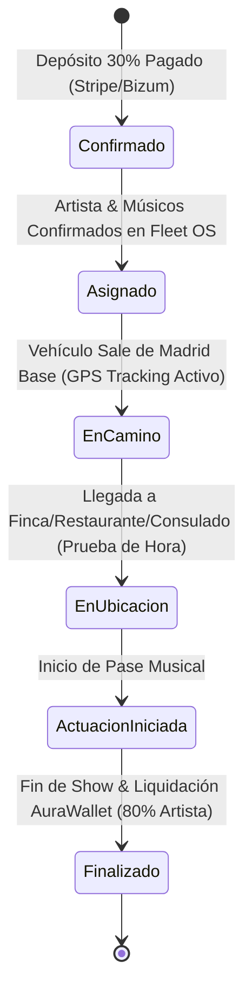

# 🚖 EAR OS — UBER-STYLE LOGISTICS, DYNAMIC PRICING & LIVE TRACKING ENGINE

> **SSOT de Motor Logístico & Cálculo Dinámico Tipo Uber:** Algoritmo de cálculo de precio base + distancia desde Madrid, emisión instantánea de recibos y tracking GPS en tiempo real para eventos en España y Europa.

---

## 1. Algoritmo de Cálculo Dinámico de Tarifa (Uber-Style Pricing)

$$\text{Precio Total} = \left( \text{BaseFormat} + \max(0, \text{KmDistancia} - 50) \times 0,35€ + \text{Peajes/Dietas} \right) \times (1 + \text{MultiplicadorUrgencia})$$

### Componentes de la Fórmula
1. **BaseFormat (Tarifa Base del Servicio):**
   - Serenata Solista de Gala: **350 €**
   - Dúo / Trío de Gala: **550 €**
   - Cuarteto Premium: **900 €**
   - Gran Show Mariachi Ensamble: **1.800 €**
2. **Distancia & Kilometraje (Desde Madrid Base):**
   - **Radio Incluido:** 0 a 50 km (0 € extra).
   - **Exceso de Distancia Peninsular:** 0,35 € / km adicional (ida y vuelta).
   - **Vuelos / Vía Rápida Europa (París, Bruselas, Roma, Ginebra):** Tarifa plana de transporte diplomático / vuelo + traslado local.
3. **Multiplicador de Fecha & Horario:**
   - Estándar: `1.0x`
   - Nochevieja / San Valentín / Días Festivos Nacionales: `1.35x`
   - Servicio Urgente <4 horas: `1.25x`

---

## 2. Emisión Instantánea de Recibo & Contrato Digital

```
┌────────────────────────────────────────────────────────────────────────┐
│ 📄 RECEPCIÓN & FACTURA DE RESERVA INMUTABLE — PRODUCTORA EAR           │
├────────────────────────────────────────────────────────────────────────┤
│ ID Reserva: EAR-2026-MAD-98421                                         │
│ Artista: Edwin Agudelo — Mariachi Solista de Gala                       │
│ Cliente: Carlos & Sofía                                                │
│ Ubicación: Finca El Regajal, Aranjuez (Madrid) — 48 km desde Base     │
├────────────────────────────────────────────────────────────────────────┤
│ DESGLOSE DE COBRO:                                                     │
│ - Tarifa Base Serenata Gala:                           350,00 €        │
│ - Kilometraje (48 km - Dentro de radio 50km):            0,00 €        │
│ - IVA (21%):                                            73,50 €        │
│ ────────────────────────────────────────────────────────────────────── │
│ TOTAL PRESUPUESTADO:                                   423,50 €        │
│ SEÑAL COBRADA (30% via Stripe/Bizum):                  127,05 € [PAID] │
│ PENDIENTE EN EVENTO (70% via AuraWallet):              296,45 €        │
├────────────────────────────────────────────────────────────────────────┤
│ 🔒 Verificación Blockchain/QR: https://productoraear.com/verify/98421   │
└────────────────────────────────────────────────────────────────────────┘
```

---

## 3. Estado de Tracking en Tiempo Real Tipo Uber (Fleet OS Live Dispatch)



---

## 4. Matriz de Combinatoria Masiva (50 Provincias de España + 28 Capitales Europeas x 8 Tipos de Evento)
- **Total de URLs Programáticas Únicas:** 50 Provincias ES x 8 Tipos de Evento = **400 URLs Únicas en España**.
- **Europa:** 28 Capitales UE x 4 Formatos Premium = **112 URLs Únicas en Europa**.
- **Gran Total:** **512 Landing Pages Programáticas de Alta Fidelidad**.
