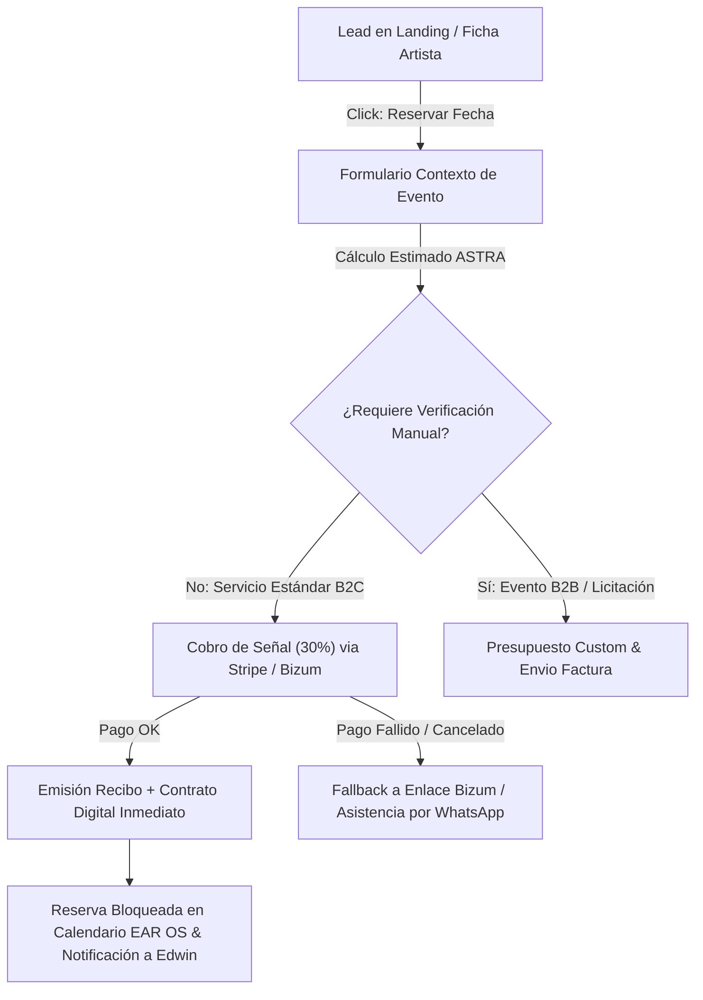

# 💳 EDWIN AGUDELO — PAYMENT & CONVERSION FLOW

> **Flujo Comercial de Cobro Inmediato:** Arquitectura de pasarela de pago (Stripe, Bizum, Transferencia) con gatillos de urgencia e idempotencia contractual.

---

## 1. Diagrama de Flujo de Conversión & Cobro

---

## 2. Configuración de Pasarelas de Pago
1. **Stripe Checkout / Elements:** Tarjeta de crédito/débito, Apple Pay, Google Pay para depósitos del 30% en tiempo real.
2. **Bizum Comercial:** Número corporativo homologado para reservas ultrarrápidas de serenatas y urgencias de 24h.
3. **Transferencia Bancaria (IBAN ES...):** Disponible para eventos corporativos y ayuntamientos que requieren factura formal con IVA.
