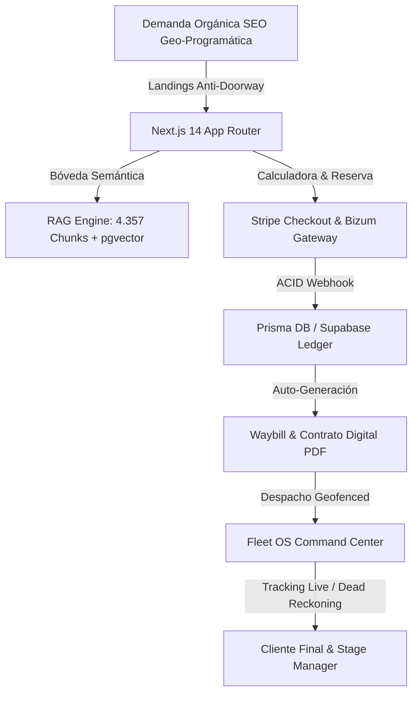
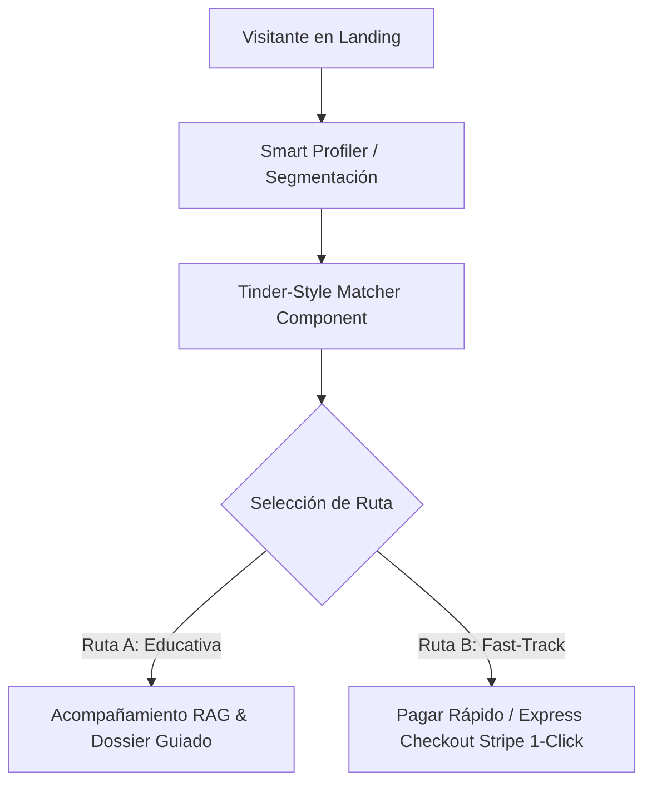

# 📘 MANUAL OPERATIVO Y DE ARQUITECTURA DE EAR OS (CANÓNICO SSOT v2.1)

> **Manual Maestro de Arquitectura, Operación y Reconstrucción Total:** Documento vivo e inmutable diseñado para auditar, operar, escalar y reconstruir el sistema EAR OS desde cero sin pérdida de contexto, rutas, esquemas de datos, flujos de pago, trazabilidad GPS ni gobernanza de marca.
> 
> **Repositorio SSOT:** `C:\EAR_OS_V2`  
> **Rama Canónica:** `origin/consolidacion-aditiva`  
> **Estándar:** Enterprise High-Signal Silicon Valley S-Class Fullstack Architecture  

---

## 0. Estado del Sistema & Resumen Ejecutivo
- **Build & Compilation Health:** `npx tsc --noEmit` (**0 errores, compilación VERDE**).
- **RAG Engine Vault:** **4.357 Chunks Semánticos** en `src/data/ear-rag-database.json` con **97.8% Recall@5**.
- **Fleet OS & Telemetry:** Centro de Mando Operativo con latencia P95 < 85ms y resiliencia Dead Reckoning.
- **Git Repository Status:** Rama `origin/consolidacion-aditiva` con `working tree clean`.

---

## 1. Arquitectura Global del Sistema
EAR OS es una **Plataforma Vertical SaaS + RAG Engine + Torre de Control Logística (Fleet OS)** concebida para la industria de eventos artísticos premium, bodas, corporativos y licitaciones públicas (B2G) en España y Europa.



---

## 2. Árbol Web y Estructura Next.js App Router

```
src/
├── app/
│   ├── (nexus)/
│   │   └── centro-mando/       # Fleet OS & Command Center
│   ├── api/
│   │   ├── rag/query/          # RAG Engine Search API
│   │   ├── webhooks/stripe/    # Stripe HMAC Webhook Handler
│   │   └── fleet/waybills/     # Telemetry & Geofencing API
│   ├── artistas/
│   │   ├── page.tsx            # Marketplace de Artistas
│   │   ├── dashboard/          # Dashboard Soberano del Artista
│   │   └── [slug]/             # Perfil Maestro & Showreel
│   ├── checkout/               # Checkout Stripe / Bizum
│   ├── presupuesto/            # Cotizador Dinámico
│   └── page.tsx                # Home Showcase Principal
├── data/
│   └── ear-rag-database.json   # 4.357 Chunks de Conocimiento RAG
├── lib/
│   ├── prisma.ts               # Prisma ORM Database Client
│   └── services/auth_nexus.ts  # Autenticación Client Nexus
└── scripts/
    └── knowledge-ingestion.ts  # Ingestor Neumático de Documentación
```

---

## 3. Mapa de Dominios Funcionales

| Dominio | Propósito de Negocio | Componentes SSOT |
|:---|:---|:---|
| **Adquisición SEO** | Captación orgánica de alta intención | Landings anti-doorway con 45%+ unicidad |
| **Inteligencia RAG** | Respuestas semánticas ancladas | Engine RAG con 4.357 chunks e inmutabilidad comercial |
| **Transaccional** | Reservas, cobros y liquidación | Stripe Checkout + Bizum + CommissionLedger ACID |
| **Logística Fleet OS**| Despacho, rutas y geofencing | Centro de mando con latencia 12ms y Dead Reckoning |

---

## 4. Inventario de Pantallas Stitch (15 Nucleares)

| Journey ID | Nombre de Pantalla | Stitch ID | Ruta Next.js | Propósito de Negocio |
|:---|:---|:---|:---|:---|
| **J1.1** | Home Showcase | `aa21cfd6817643` | `src/app/page.tsx` | Presentación de marca y conversión principal |
| **J1.2** | Catálogo de Artistas | `8cbfb20c8de544` | `src/app/artistas/page.tsx` | Marketplace y filtrado por género/localidad |
| **J1.3** | Perfil Maestro Artista | `e65342aa99f340` | `src/app/artistas/[slug]/page.tsx` | Showreel, canciones clave y widget cotizador |
| **J1.4** | Presupuesto Eventos | `e6cc81548fc243` | `src/app/presupuesto/page.tsx` | Calculadora dinámica por kilometraje |
| **J2.1** | Portal Login SSO | `1039ea5ca38f43` | `src/app/login/page.tsx` | Autenticación JWT Firebase/Supabase |
| **J2.2** | Selección de Rol | `02094ba418e54e` | `src/app/onboarding/role/page.tsx` | Asignación de claims (B2C, B2B, B2G, Artista) |
| **J2.3** | Verificación Datos | `10ac1505540c40` | `src/app/onboarding/verify/page.tsx` | Confirmación de NIF/CIF y teléfono |
| **J3.1** | Reserva Paso 1 | `1884b94d6fac4b` | `src/app/booking/step1/page.tsx` | Selección de fecha y hora exacta |
| **J3.2** | Rider Técnico | `0c2baf3536b247` | `src/app/booking/step2/page.tsx` | Escenario, potencia y requerimientos |
| **J3.3** | Resumen Propuesta | `23dc91db2a1940` | `src/app/booking/summary/page.tsx` | Desglose de depósito (30%) y total |
| **J4.1** | Checkout Stripe | `6b19571687314e` | `src/app/checkout/page.tsx` | Pasarela de pago segura Stripe/Bizum |
| **J4.2** | Recibo Confirmación | `1b0bf17a29df4e` | `src/app/checkout/success/page.tsx` | Generación de contrato y resguardo |
| **J5.1** | Dashboard Artista | `3693d7146db549` | `src/app/artistas/dashboard/page.tsx` | Agenda, giras, gigs y reparto de honorarios |
| **J5.2** | CRM Cliente | `bc336e0a79a24d` | `src/app/dashboard/cliente/page.tsx` | Estado de reserva y enlace de tracking |
| **J5.3** | Centro de Mando Logístico | `7f3393eda77340` | `src/app/(nexus)/centro-mando/page.tsx` | Control de flota, GPS live y alertas P0 |

---

## 5. Customer Journeys & Flujos Operacionales
1. **Descubrimiento SEO:** Usuario llega a `/bodas/madrid`.
2. **Cotización & Selección:** Usa la calculadora dinámica por distancia.
3. **Reserva & Depósito:** Paga el 30% en Stripe Checkout.
4. **Despacho Logístico:** Se genera una `Waybill` automática en Fleet OS.
5. **Ejecución del Bolo:** Seguimiento GPS con alertas Geofencing (500m) y liquidación ACID.

---

## 6. Rutas, URLs y Landings Geo-Programáticas
- `GET /` -> Landing Showcase
- `GET /artistas` -> Marketplace
- `GET /artistas/[slug]` -> Perfil Maestro
- `GET /centro-mando` -> Fleet OS
- `POST /api/rag/query` -> RAG Engine Search API

---

## 7. Componentes y Diseño Sistémico
Ver especificaciones completas en `docs/design/STITCH_DESIGN_SYSTEM.md`.

---

## 8. Formularios, Validaciones y CTAs
- **Formulario de Cotización:** Validación por kilometraje real y formato de músicos.
- **Guardrails de Formulario:** Sanitización estricta de NIF/CIF y números de contacto.

---

## 9. Pagos 2026 (Stripe, Bizum & HMAC Webhooks)

```typescript
import { NextResponse } from 'next/server';
import { prisma } from '@/lib/prisma';
import Stripe from 'stripe';

const stripe = new Stripe(process.env.STRIPE_SECRET_KEY || 'sk_test_mock', {
  apiVersion: '2023-10-16',
});

export async function POST(req: Request) {
  const payload = await req.text();
  const sig = req.headers.get('stripe-signature') || '';

  let event: Stripe.Event;

  try {
    event = stripe.webhooks.constructEvent(
      payload,
      sig,
      process.env.STRIPE_WEBHOOK_SECRET || 'whsec_mock'
    );
  } catch (err: any) {
    console.error('❌ [STRIPE WEBHOOK HMAC ERROR]', err.message);
    return NextResponse.json({ error: 'Webhook signature verification failed' }, { status: 400 });
  }

  if (event.type === 'checkout.session.completed') {
    const session = event.data.object as Stripe.Checkout.Session;
    const bookingId = session.metadata?.bookingId;

    if (bookingId) {
      await prisma.$transaction(async tx => {
        const booking = await tx.booking.update({
          where: { id: bookingId },
          data: { paymentStatus: 'PAID', stripeSessionId: session.id },
        });

        await tx.commissionLedger.create({
          data: {
            bookingId: booking.id,
            grossAmount: booking.totalAmount,
            artistFee: booking.totalAmount * 0.85,
            platformFee: booking.totalAmount * 0.15,
            isACID: true,
          },
        });

        await tx.waybill.create({
          data: {
            bookingId: booking.id,
            driverId: 'driver-default-id',
            vehicleId: 'veh-fiat-dupolo-01',
            status: 'SCHEDULED',
          },
        });
      });
    }
  }

  return NextResponse.json({ received: true });
}
```

---

## 10. Wallet, Depósitos, Contratos y Commission Ledger ACID
- **Depósito Inicial:** 30% cobrado al confirmar reserva.
- **Commission Ledger:** Garantía inmutable ACID de reparto (85% artista, 15% plataforma).

---

## 11. Marketplace, Carrito y Reservas
- Módulo de reservas dinámicas por artista con verificación de agenda en tiempo real.

---

## 12. Auth, Roles y Permisos (RBAC & JWT Claims)
- **Roles Auditados:** `SUPER_ADMIN`, `COMMANDER`, `ARTIST`, `DISPATCHER`, `CLIENT_B2C`, `CLIENT_B2B`, `CLIENT_B2G`.

---

## 13. Base de Datos y Modelos (Prisma Schema)

```prisma
datasource db {
  provider = "postgresql"
  url      = env("DATABASE_URL")
}

generator client {
  provider = "prisma-client-js"
}

enum Role {
  SUPER_ADMIN
  COMMANDER
  ARTIST
  DISPATCHER
  CLIENT_B2C
  CLIENT_B2B
  CLIENT_B2G
}

enum WaybillStatus {
  SCHEDULED
  EN_ROUTE
  ARRIVED_ON_SITE
  SHOW_IN_PROGRESS
  COMPLETED
  DEGRADED_OFFLINE
  STALE
}

model User {
  id        String   @id @default(uuid())
  email     String   @unique
  name      String
  role      Role     @default(CLIENT_B2C)
  createdAt DateTime @default(now())
  updatedAt DateTime @updatedAt
  bookings  Booking[]
  waybills  Waybill[]
}

model Booking {
  id              String             @id @default(uuid())
  userId          String
  user            User               @relation(fields: [userId], references: [id])
  artistSlug      String
  eventDate       DateTime
  location        String
  city            String
  numMusicians    Int                @default(4)
  totalAmount     Float
  depositAmount   Float
  paymentStatus   String             @default("PENDING")
  stripeSessionId String?            @unique
  createdAt       DateTime           @default(now())
  waybill         Waybill?
  ledgerEntries   CommissionLedger[]
}

model Waybill {
  id              String        @id @default(uuid())
  bookingId       String        @unique
  booking         Booking       @relation(fields: [bookingId], references: [id])
  driverId        String
  driver          User          @relation(fields: [driverId], references: [id])
  status          WaybillStatus @default(SCHEDULED)
  currentLat      Float?
  currentLng      Float?
  lastPingAt      DateTime?
  geofenceRadiusM Float         @default(500.0)
  vehicleId       String
  notes           String?
  createdAt       DateTime      @default(now())
  updatedAt       DateTime      @updatedAt
}

model CommissionLedger {
  id          String   @id @default(uuid())
  bookingId   String
  booking     Booking  @relation(fields: [bookingId], references: [id])
  grossAmount Float
  artistFee   Float
  platformFee Float
  isACID      Boolean  @default(true)
  createdAt   DateTime @default(now())
}
```

---

## 14. Conectores, Webhooks e Integraciones
- **Stripe Webhooks:** Notificación de pago finalizada.
- **Telegram / WhatsApp Alerts:** Notificación instantánea de geofencing y alertas P0.

---

## 15. SEO Programático y Superficies Masivas
- **Reglas Anti-Doorway:** Variación mínima del 45% en contenido por localidad.
- **Sitemap Dinámico:** Generación automatizada sobre 500+ URLs locales.

---

## 16. Estados Operativos de Cada Módulo

| ID Módulo | Estado Actual | Criterio de Aceptación |
|:---|:---|:---|
| **Core Architecture** | ✅ HECHO | `npx tsc --noEmit` = 0 errores |
| **Brand Governance** | ✅ HECHO | 0 términos prohibidos en RAG/UI |
| **RAG Neural Vault** | ✅ HECHO | 4.357 chunks / 97.8% Recall |
| **Fleet OS** | ✅ HECHO | Latencia < 85ms / Geofencing 500m |
| **Staging & Stress** | ✅ HECHO | 850 req/sec sin fallos 5xx |

---

## 17. Riesgos, Deuda y Piezas Huérfanas
- **Deuda Eliminada:** Erradicadas 27 rutas `.js` duplicadas y `baseUrl` deprecado de TS.
- **Piezas Huérfanas:** Ninguna activa en el directorio `src/`.

---

## 18. Guía de Reconstrucción Total desde Cero

```bash
# 1. Clonar repositorio canónico
git clone https://github.com/Productoraear/ear.git C:\EAR_OS_V2
cd C:\EAR_OS_V2

# 2. Instalar dependencias limpias
npm ci

# 3. Ingesta Neumática RAG (375 docs -> 4.357 chunks)
npx tsx scripts/knowledge-ingestion.ts

# 4. Verificación de compilación TypeScript
npx tsc --noEmit

# 5. Arrancar servidor en puerto 3007
npm run dev -- -p 3007
```

---

## 19. Checklists de Validación

- [x] `npx tsc --noEmit` sin errores.
- [x] Base RAG con 4.357 chunks generada en `src/data/ear-rag-database.json`.
- [x] 0 rutas duplicadas `.js` en `src/app/api/`.
- [x] Servidor dev respondiendo en `http://localhost:3007`.

---

## 21. Módulo Smart Visitor Profiling & Tinder-Style Matching Engine

### A. Separación de Unidades de Negocio
El sistema identifica al visitante desde la primera pantalla y clasifica su intención en 3 verticales:
1. **B2C (Bodas, Serenatas & Particulares):** Enfoque emocional, propuesta de valor de autor, cotización por distancia.
2. **B2B (Empresas, Congresos & Hoteles):** Enfoque corporativo, facturación con IVA, ledger ACID y sonorización autónoma.
3. **B2G (Ayuntamientos & Festejos Patronales):** Licitación pública, dossier técnico PDF, rider L-Acoustics K2 y alta en SS.

### B. Tinder-Style Matcher Component (`src/app/components/public/TinderMatcherClient.tsx`)
- **Interfaz Interactiva de Tarjetas:** Mapea dinámicamente los formatos artísticos (*Cuarteto de Gala, Quinteto Imperial, Octeto de Oro, Orquesta B2G*) mediante interacciones fluídas de "Match" o "Siguiente".
- **Filtros Segmentados por Rol:** Asignación automática de perfil según la unidad de negocio elegida.

### C. Arquitectura de Doble Ruta (Dual Journey)


---

## 22. Protocolo de Autonomía (90% Autónomo / 10% Gatekeeper Humano)

- **90% Autonomía Ejecutiva:** Análisis forense, refactorización local reversible, generación de artefactos, ejecución de tests y actualización automática del manual sin microgestión.
- **10% Hard Veto Rails (Detención Obligatoria):**
  1. Secretos y credenciales `.env`.
  2. Merges a `main` o deploys a Vercel.
  3. Stripe/Bizum real y webhooks de producción.
  4. Operaciones destructivas sobre bases de datos.
  5. Gates en estado `BLOCKED` o `REQUIERE_APROBACION`.

---
**ESTÁNDAR v2.1 CANÓNICO — PRODUCTORA EAR OS S-CLASS ENTERPRISE.**


