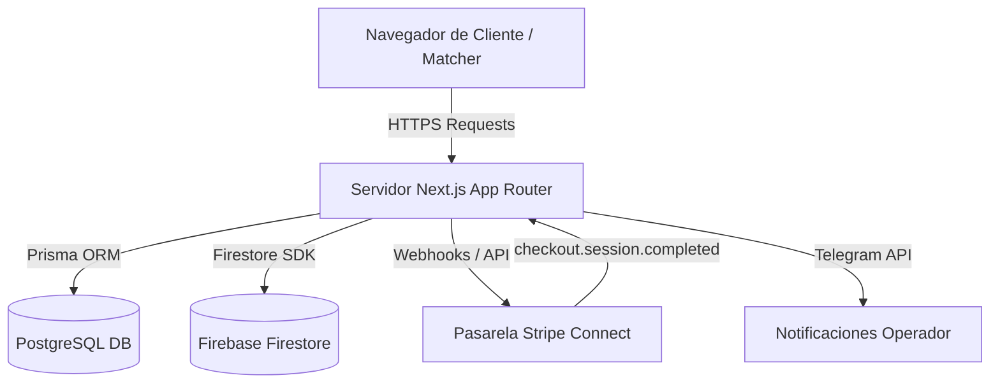

# 🏛️ Esquema General - Arquitectura de EAR OS

Esta nota define la topología de servicios distribuidos de **EAR OS**, facilitando la trazabilidad a equipos auditores sobre cómo interactúan el cliente, el servidor Next.js y los motores de persistencia.

---

## 🗺️ Mapa de Flujo de Datos

---

## 📂 Componentes Principales

### 1. Perímetro y Seguridad Activa
*   **Active Security Shield (`shield.ts`):** Filtro a nivel de servidor que intercepta y analiza firmas de scrapers automáticos en APIs dinámicas, despachando alertas inmediatas a Telegram y devolviendo `403 Forbidden`.
*   **WAF / Middleware:** Primera capa de defensa perimetral para control de sesiones y protección de sub-rutas protegidas.

### 2. Capa Contable (Ledger Leviathan)
*   **Prisma ACID `$transaction`:** Garantiza consistencia atómica total. No es posible crear una asignación de comisión sin asegurar la integridad de la billetera del artista (`AuraWallet`) y el registro del trayecto logístico (`Waybill`).
*   **Idempotency Engine:** Bloqueo de duplicados en base de datos mediante restricción `UNIQUE` en la columna `reference` de `CommissionLedger`, previniendo el doble gasto de Stripe.

### 3. Logística y Despacho (Fleet OS)
*   **Waybill Lifecycle:** Controla los estados de los trayectos (`QUEUED`, `DISPATCHED`, `IN_TRANSIT`, `ARRIVED`, `COMPLETED`).
*   **Fleet Units:** Seguimiento en tiempo real de unidades asignadas y registro de telemetría forense en `FleetTelemetryEvent`.

---

## 🔗 Notas Relacionadas
*   [[Webhook de Stripe Connect]] - Lógica detallada del webhook.
*   [[Matriz de Permisos]] - Control de acceso centralizado.
*   [[Checklist de Hardening]] - Seguridad perimetral y mitigaciones de riesgos.
