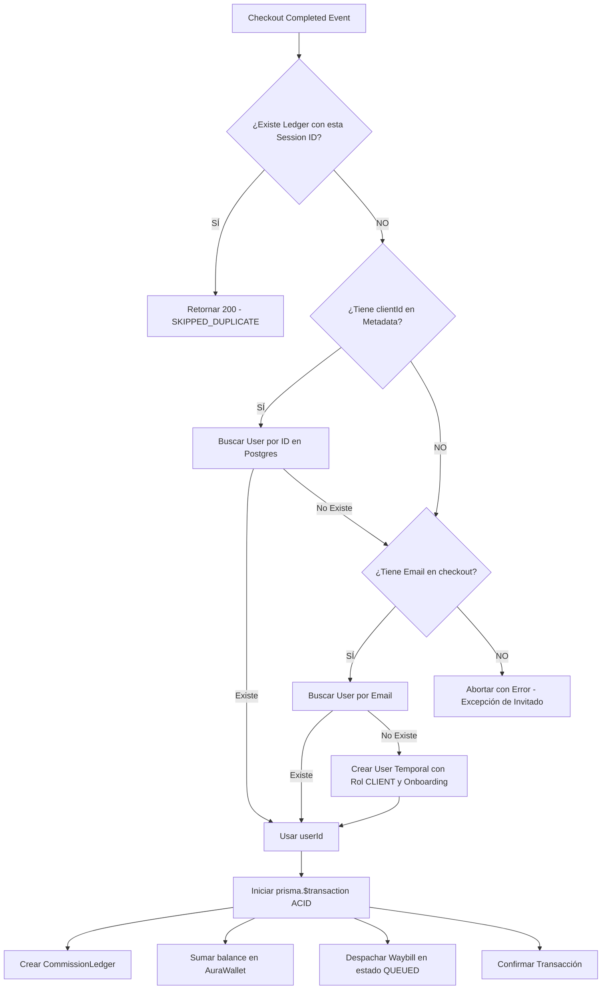

# 💳 Webhook de Stripe Connect - Flujo de Identidad y Transacciones

Esta nota detalla el diseño de ingeniería del procesador transaccional en `/api/payments/webhook/route.ts` para resolver identidades de clientes sin azar y consolidar el split monetario en una única transacción ACID.

---

## ⚡ Flujo de Control Determinista

---

## 🔒 Mecanismos de Seguridad y Resiliencia

### 1. Cero Azar (`findFirst()`)
*   Se eliminó por completo el comportamiento aleatorio de búsqueda ciega.
*   Si no hay sesión autenticada (`clientId` nulo), se utiliza el correo de facturación suministrado en la pasarela de Stripe Connect para conciliar de forma auditable.
*   En caso de que un invitado no esté registrado en el sistema local, se crea automáticamente un usuario temporal asignando su correo real y marcando su rol de forma explícita (`CLIENT`).

### 2. Idempotencia en Borde Contable
*   Para evitar la duplicación de ingresos o cobros por reintentos de Stripe, el identificador `STRIPE-${session.id}` se registra bajo restricción `UNIQUE` en la columna `reference` de `CommissionLedger`.
*   Cualquier petición concurrente o duplicada es detenida en el primer gate mediante consulta indexada ultrarrápida, saliendo con código exitoso `200` y log de advertencia en servidor.

---

## 🔗 Notas Relacionadas
*   [[Esquema General]] - Flujo global de datos.
*   [[Runbook de Rollback]] - Procedimiento de reversión ante incidentes de cobro.
