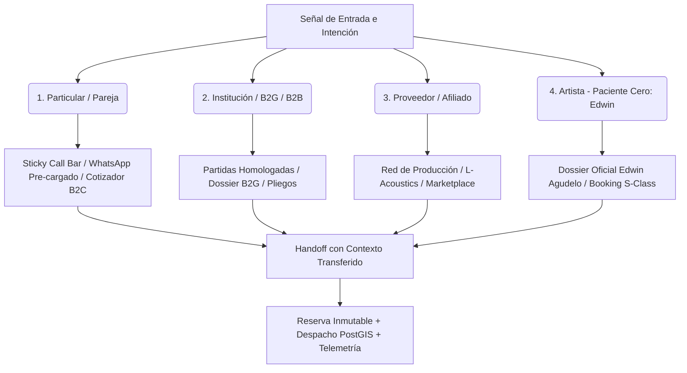

# EAR OS: La Infraestructura que Convierte Intención en Realidad

> *"EAR OS no muestra opciones: interpreta intención, reduce incertidumbre y acompaña cada decisión hasta convertirla en una actuación real, coordinada y digna."*

---

## 1. El Mercado Roto

La contratación musical nunca ha fallado por falta de talento. Ha fallado por falta de estructura.
El cliente llega con urgencia, emoción o responsabilidad institucional, y se encuentra con opacidad, tiempos muertos, precios inconsistentes y una cadena de contacto que obliga a repetirlo todo otra vez.

En ese mundo roto, el usuario no busca navegar. Busca certeza. Busca velocidad. Busca una señal clara de que alguien va a hacerse cargo de lo importante antes de que el momento se enfríe.

---

## 2. La Ventana Decisiva

Todo se decide en segundos.
Si la experiencia obliga a pensar demasiado, rellenar demasiado o esperar demasiado, el lead pierde temperatura y el cierre se rompe. Por eso la batalla real no está en "tener una web", sino en responder correctamente en el primer contacto, en el primer cálculo y en el primer gesto del pulgar.

EAR OS nace exactamente ahí: en la frontera entre la intención y el abandono. No espera a que el usuario entienda el sistema; hace que el sistema entienda al usuario.

> *"EAR OS no solo adapta el contenido a la intención; adapta el canal, la jerarquía, la ergonomía y la acción al momento exacto en que cada perfil está listo para avanzar, con prioridad explícita sobre la visibilidad y la economía del artista que valida el sistema: Edwin Agudelo."*

---

## 3. Cuatro Perfiles, Cuatro Caminos, Una Sola Inteligencia

EAR OS no presenta un recorrido uniforme para todos. Reordena la experiencia según la naturaleza de la necesidad:

### 1. Particular / Pareja (Emoción, Claridad y Cierre Inmediato)
- **El Contexto:** Bodas, cumpleaños, aniversarios y serenatas. Llega con emoción y necesidad de certeza de fecha y presupuesto.
- **La Respuesta:** Jerarquía simplificada. Sticky Call Bar móvil (`+34 693 693 048`), WhatsApp pre-rellenado con contexto y acceso en 1 tap a la contratación de Edwin Agudelo y sus mariachis de gala.

### 2. Institución / B2G / B2B (Solvencia Técnica y Garantía Legal)
- **El Contexto:** Fiestas patronales, galas corporativas y licitaciones públicas. Requiere cumplimiento de la LCSP, seguros RC (1.000.000€), altas laborales y facturación FACe.
- **La Respuesta:** Despliegue de infraestructura S-Class (audio L-Acoustics K2, microfonía Axient, rider homologado) y dossier técnico oficial descargable.

### 3. Proveedor / Afiliado (Integración, Demanda y Retorno)
- **El Contexto:** Empresas de sonido, iluminación, tarimas y catering que buscan rentabilizar su inventario y logística.
- **La Respuesta:** Integración formal en la red de despacho logístico PostGIS de Productora EAR con asignación transparente de hojas de ruta (`Waybill`).

### 4. Artista (Paciente Cero: Edwin Agudelo)
- **El Contexto:** Vivir dignamente de su arte, multiplicar su alcance geográfico y monetizar con anticipos seguros y respeto profesional.
- **La Validación Viva:** *Edwin Agudelo no es un perfil más; es la validación empírica del sistema.* Si EAR OS mejora su visibilidad, su autoridad y su volumen de contratación en bodas, cumpleaños, serenatas y festivales, la tesis queda demostrada.

---

## 4. De Catálogo a Acompañamiento

| Dimensión | El Modelo Tradicional (Roto) | La Realidad de EAR OS (Transformada) |
|---|---|---|
| **Punto de Entrada** | Home estática y catálogo genérico | Router adaptativo de 4 perfiles con tarjeta de honor a Edwin |
| **Tiempo de Cotización** | 24 - 72 horas vía email | Cálculo matemático instantáneo en vivo (`pricing-engine.ts`) |
| **Handoff a Contacto** | Chat vacío o auto-redirección | Hub multicanal soberano (Tel, WhatsApp context, Formulario) |
| **Ergonomía Táctil** | Interfaces comprimidas de desktop | Mobile-first real, tap targets ≥44px y sticky bar con total |
| **Garantía de Reserva** | Promesa verbal o justificante manual | Bloqueo atómico de calendario y depósito trazable |
| **Coordinación de Flota** | Músicos desorientados en carretera | Hoja de ruta `Waybill` despachada vía PostGIS |
| **Liquidación Económica** | Cobros en efectivo desregulados | Asiento contable trazable en `CommissionLedger` |

---

## 5. La Prueba Real

La superioridad de EAR OS se demuestra en los puntos críticos de conversión:

1. **El teléfono está siempre accesible:** Click-to-call universal anclado en `CENTRALITA.tel`.
2. **El WhatsApp llega con contexto:** Inyección automática de ítems, provincia e importe calculado.
3. **El precio nace del mismo motor:** `pricing-engine.ts` unifica web, centralita y cierre.
4. **La interfaz respeta el pulgar:** Totales sticky, navegación fluida y sin bloqueos de zoom.
5. **Edwin Agudelo siempre visible:** Acceso prioritario desde la Home y landings de ocasión.

---

## Conclusión

> *"Cuando el usuario llega con urgencia, EAR OS responde con claridad. Cuando llega con duda, responde con cálculo. Cuando llega con decisión, responde con cierre.*
> 
> *Lo que antes era improvisación ahora es una cadena de confianza, coordinación y reserva trazable."*
