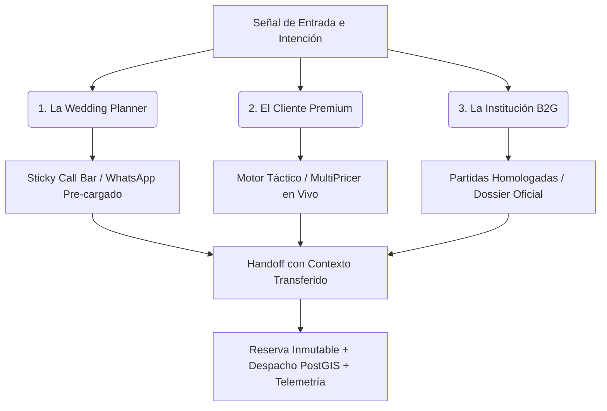

# EAR OS: La Transformación de la Contratación Musical

> *"EAR OS no es una interfaz para contratar música. Es un sistema que interpreta intención, reduce incertidumbre y acompaña cada decisión hasta convertirla en una actuación real, coordinada y digna."*

---

## 1. El Mundo Roto

Contratar música para un momento irrepetible siempre ha sido opaco, lento e improvisado. 

- El cliente no sabe a quién llamar ni cuánto cuesta realmente un servicio de calidad.
- El gremio musical trabaja en la dispersión, sin contratos vinculantes, sin anticipos asegurados y con una logística desorganizada.
- El evento depende de la buena suerte: presupuestos que cambian por teléfono, intermediarios que inflan costes y llamadas sin respuesta.
- La contratación carece de trazabilidad, de dignidad profesional y de rigor operativo.

El cliente no entra a una web para "navegar un catálogo". Busca **certeza**, **velocidad** y alguien que se haga cargo del momento más importante de su vida o de su institución.

---

## 2. El Momento de Verdad

Todo se decide en menos de 20 segundos. 

Cuando una persona aterriza desde una búsqueda en Google, ve un número de teléfono o calcula un presupuesto, cualquier fricción enfría el lead. Si el sistema le exige rellenar formularios largos, esperar 48 horas por un correo o repetir tres veces qué necesita, el usuario abandona.

**La verdad de mercado:**
- Quien tiene una urgencia, necesita un canal directo.
- Quien tiene dudas, necesita una tarifa transparente.
- Quien tiene un pliego institucional, necesita solvencia técnica y garantías legales.

---

## 3. La Respuesta de EAR OS: Tres Protagonistas, Tres Caminos

EAR OS no obliga al usuario a aprender una interfaz rígida; **adapta la experiencia a la necesidad del protagonista**.

### 1. La Wedding Planner (Madrid, 23:45h — Boda en Riesgo)
- **El Conflicto:** Quedan semanas para el evento, el proveedor anterior ha fallado y necesita resolver el cuarteto de mariachis, la sonorización y la iluminación sin margen de error.
- **La Respuesta:** No ve menús confusos. Ve la **Sticky Call Bar móvil**, pulsa el botón directo y conecta con la centralita (`+34 693 693 048`). Al abrir WhatsApp, el mensaje ya viene pre-rellenado con la fecha, la provincia y el formato deseado. Fricción cero.

### 2. El Cliente Premium (Planificación de Gran Gala)
- **El Conflicto:** Quiere excelencia acústica y presencia escénica, pero desconfía de precios arbitrarios o inflados.
- **La Respuesta:** Aterriza en el **Motor Táctico** (`/cotizador`). Ajusta formación, kilómetros y sonido. El sistema calcula en vivo mediante un motor determinista (`pricing-engine.ts`) el desglose exacto (Base + Logística + IVA). Puede asegurar su fecha inmediatamente con tarjeta o Klarna.

### 3. La Institución / Sector Público (Fiestas Patronales y Festivales)
- **El Conflicto:** Necesita justificación técnica, cumplimiento de pólizas de RC (1.000.000€), altas en Seguridad Social y solvencia de pliegos.
- **La Respuesta:** La plataforma despliega el catálogo de infraestructura (`MultiPricer` B2G), audio L-Acoustics y documentación de autoridad (VIMUME y Dossier de Autoridad), asegurando contratación legal blindada.

---

## 4. La Transformación: Antes vs. Después

| Dimensión | El Modelo Tradicional (Roto) | La Realidad de EAR OS (Transformada) |
|---|---|---|
| **Punto de Entrada** | Home estática y catálogo genérico | Experiencia adaptada a la intención de búsqueda |
| **Tiempo de Cotización** | 24 - 72 horas vía email | Cálculo matemático instantáneo (SSOT) |
| **Handoff a Contacto** | Chat vacío ("Hola, ¿en qué te ayudo?") | WhatsApp estructurado con presupuesto y datos inyectados |
| **Garantía de Reserva** | Promesa verbal o justificante manual | Bloqueo atómico de calendario y depósito Stripe |
| **Coordinación de Flota** | Músicos desorientados en carretera | Hoja de ruta `Waybill` despachada vía PostGIS |
| **Liquidación Económica** | Cobros en efectivo desregulados | Asiento contable trazable en `CommissionLedger` |

---

## 5. Evidencia Observable y Prueba de Impacto

La superioridad de EAR OS no es un concepto teórico; es un sistema en ejecución:

1. **Click-to-Call Universal (`CENTRALITA.tel`):** Conexión inmediata al `+34 693 693 048` anclada en todas las landings públicas.
2. **Sticky Mobile Bar (`z-90`):** Máxima tasa de conversión en dispositivos móviles sin obstaculizar la lectura.
3. **WhatsApp con Contexto Transferido:** El operador recibe el desglose técnico antes del primer mensaje, eliminando la repetición de datos.
4. **Single Source of Truth (`pricing-engine.ts`):** Una única regla algorítmica para web, llamada y pasarela.
5. **Despacho Espacial y Ledger Inmutable:** Enlace directo entre el cobro de la reserva, el calendario bloqueado y la hoja de ruta del artista.

---

## Conclusión

> *"Cuando el usuario llega con urgencia, EAR OS responde con claridad. Cuando llega con duda, responde con cálculo. Cuando llega decidido, responde con cierre.*
> 
> *Lo que antes era incertidumbre, ahora se convierte en una reserva trazable, coordinada y digna."*
