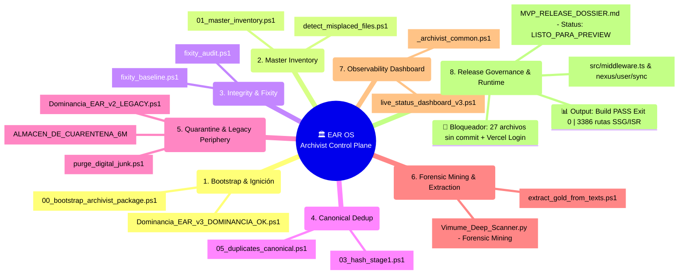

# 🧠 MAPA MENTAL EJECUTIVO — EAR OS / ARCHIVIST CONTROL PLANE
> **Interfaz Estratégica de Lectura Rápida**  
> **SSOT Estructural:** `EAR_OS_KNOWLEDGE_GRAPH.md`  
> **Regla Inmutable:** El Mapa Mental sintetiza y presenta; el Grafo manda y estructura.

---

## 1. VISTA JERÁRQUICA ULTRAEJECUTIVA (MERMAID)

---

## 2. ANILLOS OPERATIVOS DE LECTURA RÁPIDA

### 🎯 CENTRO GRAVITACIONAL
- **`EAR OS / Archivist Control Plane`** (`C:\EAR_OS_V2`): Núcleo absoluto de información y orquestación.

### ⭕ ANILLOS FUNCIONALES Y MOTORES (SCRIPTS PRINCIPALES)
1. **Bootstrap & Ignición:** `Dominancia_EAR_v3_DOMINANCIA_OK.ps1` | `00_bootstrap_archivist_package.ps1`
2. **Master Inventory:** `01_master_inventory.ps1` | `detect_misplaced_files.ps1`
3. **Integrity & Fixity:** `fixity_audit.ps1` | `fixity_baseline.ps1`
4. **Canonical Dedup:** `05_duplicates_canonical.ps1` | `03_hash_stage1.ps1`
5. **Quarantine & Legacy (Periferia):** `purge_digital_junk.ps1` | `ALMACEN_DE_CUARENTENA_6M` | `Dominancia_EAR_v2_LEGACY.ps1`
6. **Extraction & Forensic Mining:** `extract_gold_from_texts.ps1` | `Vimume_Deep_Scanner.py` (Minería del dominio Vimume)
7. **Observability Dashboard:** `live_status_dashboard_v3.ps1` | `_archivist_common.ps1`
8. **Release Governance:** `MVP_RELEASE_DOSSIER.md` | `MVP_EXECUTION_QUEUE.md` | `src/middleware.ts`

---

## 3. RESUMEN DE BLOQUEADORES Y OUTPUTS CERTIFICADOS

- **🚨 Bloqueadores Operativos (Acción Humana):** 27 archivos no commiteados + Vercel CLI sin autenticar.
- **📊 Outputs Certificados:** Build Next.js 16.2.12 PASS (exit 0), 3.386 rutas, JWT Auth Server verificado.
- **🔍 Verdad Estructural Detallada:** Consultar [EAR_OS_KNOWLEDGE_GRAPH.md](file:///c:/EAR_OS_V2/docs/release/EAR_OS_KNOWLEDGE_GRAPH.md).
