# 🕸️ GRAFO DE CONOCIMIENTO ESTRUCTURAL — EAR OS V2
> **SSOT Audit Date:** 2026-08-06  
> **Repository Root:** `C:\EAR_OS_V2`  
> **Role:** Structural Source of Truth (Verdad Estructural Completa)  
> **Governance:** Non-destructive, 100% reversible, audit-backed.

---

## 1. ESQUEMA DE ESTADOS Y PESOS

### Estados de Nodos (`Node Status`)
- **`core`**: Artefacto activo y crítico en la arquitectura de producción o en el plano de control primario.
- **`candidate`**: Artefacto evaluado para integración en el MVP o en el kernel activo.
- **`legacy`**: Artefacto de versiones anteriores en funcionamiento parcial o mantenido por compatibilidad.
- **`quarantined`**: Artefacto aislado en carpetas de cuarentena (`ALMACEN_DE_CUARENTENA_6M`, `99_CUARENTENA_COGNITIVA`, `quarantine`).
- **`deprecated`**: Artefacto sustituido formalmente por un equivalente moderno.
- **`orphan`**: Artefacto sin referencias explícitas vivas o desconectado del flujo activo.
- **`external`**: Servicio, API o infraestructura externa (Firebase, Vercel, Supabase, Stripe).

### Tipos y Pesos de Aristas (`Edge Weight`)
| Tipo de Arista | Significado / Naturaleza | Peso (`0.0 - 1.0`) |
|---|---|---|
| `dependencia` | Requisito de ejecución o import directo de código/runtime | `1.0` |
| `uso_operativo` | Invocación en runtime o en scripts de orquestación activa | `0.9` |
| `remplazo` | Sustitución formal de un artefacto por uno nuevo | `0.8` |
| `origen` / `derivado` | Genealogía y transformación de datos o conocimientos | `0.7` |
| `referencia` | Mención o documentación explícita en SSOT/MOC | `0.6` |
| `version` | Evolución incremental de un mismo componente | `0.5` |
| `duplicado` | Copia idéntica o variante detectada por hashing forense | `0.4` |
| `cuarentena` | Aislamiento preventivo por riesgo o desuso | `0.3` |
| `impacto` / `riesgo` | Posible punto de fallo sistémico o deuda técnica | `0.2` |

---

## 2. GRAFO DE CONOCIMIENTO COMPLETO (VISUAL MERMAID)

```mermaid
graph TD
    %% SUBGRAFOS Y NODOS

    subgraph PLANO_DE_CONTROL["🏛️ Archivist Control Plane & SSOT (Core)"]
        SSOT["01_SSOT_Y_KERNELS/CLINE_OMEGA_KERNEL.md<br/>[core | SSOT]"]
        MOC["00_MOC_MAESTRO.md<br/>[core | Index]"]
        DOSSIER["docs/release/MVP_RELEASE_DOSSIER.md<br/>[core | Release Dossier]"]
        QUEUE["docs/release/MVP_EXECUTION_QUEUE.md<br/>[core | Queue]"]
        DOMINANCIA["Dominancia_EAR_v3_DOMINANCIA_OK.ps1<br/>[core | Orchestrator]"]
        DASHBOARD["EAR_OS_CONTROL/scripts/live_status_dashboard_v3.ps1<br/>[core | Dashboard]"]
    end

    subgraph INVENTARIO_Y_FIXITY["🔍 Ingestion, Inventory & Fixity"]
        BOOTSTRAP_PKG["EAR_OS_CONTROL/scripts/00_bootstrap_archivist_package.ps1<br/>[core | Pipeline]"]
        MASTER_INV["EAR_OS_CONTROL/scripts/01_master_inventory.ps1<br/>[core | Script]"]
        HASH_STAGE1["EAR_OS_CONTROL/scripts/03_hash_stage1.ps1<br/>[core | Script]"]
        DUPS_CANONICAL["EAR_OS_CONTROL/scripts/05_duplicates_canonical.ps1<br/>[core | Script]"]
        FIXITY_AUDIT["EAR_OS_CONTROL/scripts/fixity_audit.ps1<br/>[core | Script]"]
        COMMON_LIB["EAR_OS_CONTROL/scripts/_archivist_common.ps1<br/>[core | Shared Lib]"]
    end

    subgraph NEXTJS_RUNTIME["⚡ Next.js App & Auth/Pay Infrastructure"]
        MIDDLEWARE["src/middleware.ts<br/>[core | Edge Auth Guard]"]
        USER_SYNC["src/app/api/nexus/user/sync/route.ts<br/>[core | API Sync]"]
        FIREBASE_ADMIN["src/lib/firebaseAdmin.ts<br/>[core | Auth Server]"]
        USER_SERVICE["src/lib/services/UserService.ts<br/>[core | Service RBAC]"]
        STRIPE_LIB["src/lib/payments.ts<br/>[candidate | Stripe Client]"]
    end

    subgraph FORENSIC_AND_MINING["⛏️ Forensic Mining & Extraction"]
        ADN_SCANNER["scripts/01_ESCANER_FORENSE_ADN.py<br/>[legacy | Forensic]"]
        TEXT_GOLD["EAR_OS_CONTROL/scripts/extract_gold_from_texts.ps1<br/>[core | Mining]"]
        CLASSIFIER["scripts/ClasificadorForense.py<br/>[legacy | Forensic]"]
        VIMUME_SCAN["scripts/Vimume_Deep_Scanner.py<br/>[candidate | Domain Scan]"]
    end

    subgraph QUARANTINE_AND_RESIDUES["☣️ Quarantine & Residue Compartments"]
        CUARENTENA_6M["ALMACEN_DE_CUARENTENA_6M/<br/>[quarantined | Storage]"]
        CUARENTENA_COG["99_CUARENTENA_COGNITIVA/<br/>[quarantined | Storage]"]
        LEGACY_DOMINANCIA["Dominancia_EAR_v2_LEGACY.ps1<br/>[deprecated | Residue]"]
        PURGE_SCRIPT["EAR_OS_CONTROL/scripts/purge_digital_junk.ps1<br/>[core | Maintenance]"]
        ORPHAN_PROMPTS["EAR_OS_OMEGA_PROMPTS.md<br/>[candidate | Legacy Prompts]"]
    end

    subgraph EXTERNAL_SERVICES["☁️ External Sovereign Infrastructure"]
        FIREBASE_CLOUD["Firebase Auth<br/>[external | Identity]"]
        VERCEL_CLOUD["Vercel Edge / Hosting<br/>[external | Deployment]"]
        STRIPE_CLOUD["Stripe Payments API<br/>[external | Finance]"]
        SUPABASE_CLOUD["Supabase PostgreSQL<br/>[external | DB]"]
    end

    %% ARISTAS Y CONEXIONES CON PESOS (IMPLÍCITAS Y EXPLÍCITAS)

    DOMINANCIA -- "uso_operativo (1.0)" --> DASHBOARD
    DOMINANCIA -- "referencia (0.9)" --> SSOT
    DASHBOARD -- "dependencia (1.0)" --> COMMON_LIB
    BOOTSTRAP_PKG -- "uso_operativo (1.0)" --> MASTER_INV
    MASTER_INV -- "uso_operativo (0.9)" --> HASH_STAGE1
    HASH_STAGE1 -- "uso_operativo (0.9)" --> DUPS_CANONICAL
    DUPS_CANONICAL -- "cuarentena (0.8)" --> PURGE_SCRIPT
    PURGE_SCRIPT -- "cuarentena (0.9)" --> CUARENTENA_6M

    DOSSIER -- "referencia (1.0)" --> QUEUE
    QUEUE -- "uso_operativo (1.0)" --> MIDDLEWARE
    MIDDLEWARE -- "dependencia (1.0)" --> USER_SYNC
    USER_SYNC -- "dependencia (1.0)" --> FIREBASE_ADMIN
    USER_SYNC -- "dependencia (1.0)" --> USER_SERVICE
    FIREBASE_ADMIN -- "dependencia (1.0)" --> FIREBASE_CLOUD

    STRIPE_LIB -- "riesgo (0.7)" --> STRIPE_CLOUD
    USER_SERVICE -- "referencia (0.8)" --> SUPABASE_CLOUD

    DOMINANCIA -- "remplazo (0.9)" --> LEGACY_DOMINANCIA
    ADN_SCANNER -- "origen (0.7)" --> CLASSIFIER
    TEXT_GOLD -- "derivado (0.7)" --> CUARENTENA_COG
    ORPHAN_PROMPTS -- "referencia (0.5)" --> MOC
```



---

## 3. TABLA AUDITABLE DE NODOS Y ATRIBUTOS

| ID Nodo | Ruta Exacta / Nombre | Categoría | Estado | Descripción | Evidencia de Registro |
|---|---|---|---|---|---|
| `N-01` | `01_SSOT_Y_KERNELS/CLINE_OMEGA_KERNEL.md` | SSOT | `core` | Kernel de gobernanza y reglas inmutables de EAR OS. | `c:\EAR_OS_V2\01_SSOT_Y_KERNELS` |
| `N-02` | `docs/release/MVP_RELEASE_DOSSIER.md` | Release | `core` | Dossier de estado de producción y gates. | `c:\EAR_OS_V2\docs\release` |
| `N-03` | `docs/release/MVP_EXECUTION_QUEUE.md` | Release | `core` | Cola de tareas P0/P1 aprobadas para release. | `c:\EAR_OS_V2\docs\release` |
| `N-04` | `EAR_OS_CONTROL/scripts/live_status_dashboard_v3.ps1` | Dashboard | `core` | Dashboard de observabilidad en vivo (22KB, v3). | `c:\EAR_OS_V2\EAR_OS_CONTROL\scripts` |
| `N-05` | `Dominancia_EAR_v3_DOMINANCIA_OK.ps1` | Orchestrator | `core` | Script principal de ignición y orquestación. | `c:\EAR_OS_V2\` |
| `N-06` | `EAR_OS_CONTROL/scripts/00_bootstrap_archivist_package.ps1` | Pipeline | `core` | Empaquetador y pipeline de ingesta Archivist. | `c:\EAR_OS_V2\EAR_OS_CONTROL\scripts` |
| `N-07` | `EAR_OS_CONTROL/scripts/01_master_inventory.ps1` | Inventory | `core` | Escáner maestro de inventario territorial. | `c:\EAR_OS_V2\EAR_OS_CONTROL\scripts` |
| `N-08` | `EAR_OS_CONTROL/scripts/fixity_audit.ps1` | Integrity | `core` | Validador de firma hash e integridad de archivos. | `c:\EAR_OS_V2\EAR_OS_CONTROL\scripts` |
| `N-09` | `EAR_OS_CONTROL/scripts/05_duplicates_canonical.ps1` | Dedup | `core` | Identificador de duplicados binarios/texto. | `c:\EAR_OS_V2\EAR_OS_CONTROL\scripts` |
| `N-10` | `EAR_OS_CONTROL/scripts/purge_digital_junk.ps1` | Quarantine | `core` | Aislador de residuos y archivos basura a cuarentena. | `c:\EAR_OS_V2\EAR_OS_CONTROL\scripts` |
| `N-11` | `src/middleware.ts` | Edge Security | `core` | Guardián de rutas protegidas mediante cookies en Edge. | `c:\EAR_OS_V2\src` |
| `N-12` | `src/app/api/nexus/user/sync/route.ts` | API Auth | `core` | Endpoint de validación JWT de Firebase Admin. | `c:\EAR_OS_V2\src\app\api` |
| `N-13` | `src/lib/firebaseAdmin.ts` | Auth Infrastructure | `core` | Singleton de inicialización SDK Firebase Admin. | `c:\EAR_OS_V2\src\lib` |
| `N-14` | `src/lib/services/UserService.ts` | RBAC Service | `core` | Servicio de asignación de roles sin escalada por email. | `c:\EAR_OS_V2\src\lib\services` |
| `N-15` | `Dominancia_EAR_v2_LEGACY.ps1` | Orchestrator | `deprecated` | Versión obsoleta v2 sustituida por v3. | `c:\EAR_OS_V2\` |
| `N-16` | `scripts/01_ESCANER_FORENSE_ADN.py` | Forensic | `legacy` | Script de análisis forense preliminar. | `c:\EAR_OS_V2\scripts` |
| `N-17` | `ALMACEN_DE_CUARENTENA_6M` | Storage | `quarantined` | Contenedor físico de preservación a 6 meses. | `c:\EAR_OS_V2\` |
| `N-18` | `99_CUARENTENA_COGNITIVA` | Storage | `quarantined` | Depósito de notas y documentos no estructurados. | `c:\EAR_OS_V2\` |
| `N-19` | `EAR_OS_OMEGA_PROMPTS.md` | Prompts | `candidate` | Colección histórica de prompts de orquestación. | `c:\EAR_OS_V2\` |
| `N-20` | `src/lib/payments.ts` | Payments | `candidate` | Módulo cliente de integración con Stripe. | `c:\EAR_OS_V2\src\lib` |

---

## 4. MATRIZ AUDITABLE DE RELACIONES (ARISTAS Y PESOS)

| Origen | Destino | Tipo de Arista | Peso | Naturaleza de la Relación |
|---|---|---|---|---|
| `N-05` (`Dominancia_EAR_v3`) | `N-04` (`live_status_dashboard`) | `uso_operativo` | `1.0` | Invocación directa para renderizado de consola. |
| `N-04` (`live_status_dashboard`) | `N-06` (`_archivist_common`) | `dependencia` | `1.0` | Carga funciones compartidas de hashing e inventario. |
| `N-06` (`00_bootstrap_archivist`) | `N-07` (`01_master_inventory`) | `uso_operativo` | `1.0` | Lanza escaneo secuencial en pipeline. |
| `N-07` (`01_master_inventory`) | `N-09` (`05_duplicates`) | `uso_operativo` | `0.9` | Alimenta lista de candidatos a duplicados. |
| `N-09` (`05_duplicates`) | `N-10` (`purge_digital_junk`) | `cuarentena` | `0.8` | Envía archivos redundantes a aislamiento. |
| `N-10` (`purge_digital_junk`) | `N-17` (`ALMACEN_DE_CUARENTENA_6M`) | `cuarentena` | `0.9` | Mueve archivos sin destruir hacia storage. |
| `N-02` (`MVP_RELEASE_DOSSIER`) | `N-03` (`MVP_EXECUTION_QUEUE`) | `referencia` | `1.0` | Dossier certifica el estado de la cola. |
| `N-03` (`MVP_EXECUTION_QUEUE`) | `N-11` (`src/middleware.ts`) | `uso_operativo` | `1.0` | Certifica gate de auth en edge. |
| `N-11` (`src/middleware.ts`) | `N-12` (`user/sync/route`) | `dependencia` | `1.0` | Protege la ruta de sincronización de usuario. |
| `N-12` (`user/sync/route`) | `N-13` (`firebaseAdmin`) | `dependencia` | `1.0` | Llama `verifyIdToken()` con SDK Server. |
| `N-12` (`user/sync/route`) | `N-14` (`UserService`) | `dependencia` | `1.0` | Invoca lógica de asignación RBAC. |
| `N-05` (`Dominancia_EAR_v3`) | `N-15` (`Dominancia_v2_LEGACY`) | `remplazo` | `0.9` | Reemplaza script monolítico previo. |
| `N-19` (`EAR_OS_OMEGA_PROMPTS`) | `N-01` (`CLINE_OMEGA_KERNEL`) | `referencia` | `0.5` | Prompts antiguos de los que deriva el Kernel v2.1. |

---

## 5. EXPORTACIÓN JSON NAVEGABLE DE GRAFO

```json
{
  "meta": {
    "system": "EAR OS V2",
    "version": "2.2-OMEGA",
    "type": "Structural Knowledge Graph",
    "timestamp": "2026-08-06T20:12:00Z"
  },
  "nodes": [
    {"id": "N-01", "path": "01_SSOT_Y_KERNELS/CLINE_OMEGA_KERNEL.md", "status": "core", "type": "SSOT"},
    {"id": "N-02", "path": "docs/release/MVP_RELEASE_DOSSIER.md", "status": "core", "type": "Release"},
    {"id": "N-03", "path": "docs/release/MVP_EXECUTION_QUEUE.md", "status": "core", "type": "Release"},
    {"id": "N-04", "path": "EAR_OS_CONTROL/scripts/live_status_dashboard_v3.ps1", "status": "core", "type": "Dashboard"},
    {"id": "N-05", "path": "Dominancia_EAR_v3_DOMINANCIA_OK.ps1", "status": "core", "type": "Orchestrator"},
    {"id": "N-06", "path": "EAR_OS_CONTROL/scripts/00_bootstrap_archivist_package.ps1", "status": "core", "type": "Pipeline"},
    {"id": "N-07", "path": "EAR_OS_CONTROL/scripts/01_master_inventory.ps1", "status": "core", "type": "Inventory"},
    {"id": "N-08", "path": "EAR_OS_CONTROL/scripts/fixity_audit.ps1", "status": "core", "type": "Integrity"},
    {"id": "N-09", "path": "EAR_OS_CONTROL/scripts/05_duplicates_canonical.ps1", "status": "core", "type": "Dedup"},
    {"id": "N-10", "path": "EAR_OS_CONTROL/scripts/purge_digital_junk.ps1", "status": "core", "type": "Quarantine"},
    {"id": "N-11", "path": "src/middleware.ts", "status": "core", "type": "Edge Security"},
    {"id": "N-12", "path": "src/app/api/nexus/user/sync/route.ts", "status": "core", "type": "API Auth"},
    {"id": "N-13", "path": "src/lib/firebaseAdmin.ts", "status": "core", "type": "Auth Infra"},
    {"id": "N-14", "path": "src/lib/services/UserService.ts", "status": "core", "type": "RBAC Service"},
    {"id": "N-15", "path": "Dominancia_EAR_v2_LEGACY.ps1", "status": "deprecated", "type": "Residue"},
    {"id": "N-16", "path": "scripts/01_ESCANER_FORENSE_ADN.py", "status": "legacy", "type": "Forensic"},
    {"id": "N-17", "path": "ALMACEN_DE_CUARENTENA_6M", "status": "quarantined", "type": "Storage"},
    {"id": "N-18", "path": "99_CUARENTENA_COGNITIVA", "status": "quarantined", "type": "Storage"},
    {"id": "N-19", "path": "EAR_OS_OMEGA_PROMPTS.md", "status": "candidate", "type": "Prompts"},
    {"id": "N-20", "path": "src/lib/payments.ts", "status": "candidate", "type": "Payments"}
  ],
  "edges": [
    {"from": "N-05", "to": "N-04", "relation": "uso_operativo", "weight": 1.0},
    {"from": "N-04", "to": "N-06", "relation": "dependencia", "weight": 1.0},
    {"from": "N-06", "to": "N-07", "relation": "uso_operativo", "weight": 1.0},
    {"from": "N-07", "to": "N-09", "relation": "uso_operativo", "weight": 0.9},
    {"from": "N-09", "to": "N-10", "relation": "cuarentena", "weight": 0.8},
    {"from": "N-10", "to": "N-17", "relation": "cuarentena", "weight": 0.9},
    {"from": "N-02", "to": "N-03", "relation": "referencia", "weight": 1.0},
    {"from": "N-03", "to": "N-11", "relation": "uso_operativo", "weight": 1.0},
    {"from": "N-11", "to": "N-12", "relation": "dependencia", "weight": 1.0},
    {"from": "N-12", "to": "N-13", "relation": "dependencia", "weight": 1.0},
    {"from": "N-12", "to": "N-14", "relation": "dependencia", "weight": 1.0},
    {"from": "N-05", "to": "N-15", "relation": "remplazo", "weight": 0.9},
    {"from": "N-19", "to": "N-01", "relation": "referencia", "weight": 0.5}
  ]
}
```
