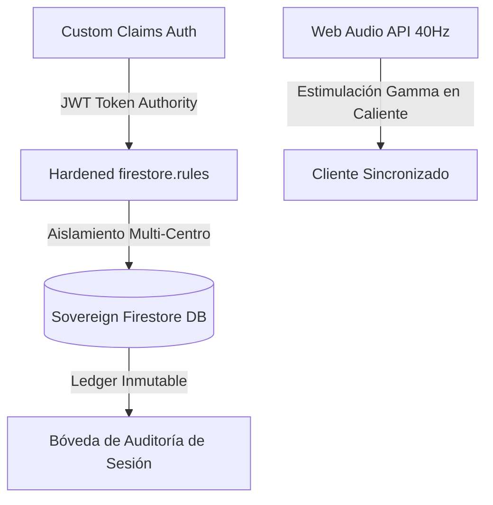

# 🕊️ Hermes Tracker OT — Clinical Documentation Suite (S-Class Edition)

Bienvenido a la suite oficial de documentación de **Hermes Tracker OT**, la plataforma de telemetría, musicoterapia sincrónica Gamma y gobernanza del deterioro cognitivo de **VIMUME / EAR OS** para **productoraear.com**.

Este espacio recopila, con el máximo rigor editorial e ingeniería de sistemas, toda la especificación técnica, manuales clínicos de usuario y guías de administración soberana del ecosistema.

---

## 📂 Directorio de Recursos Clínicos y Operativos

### 1. Manual de Usuario (Clínico y Familiar)
* **Propósito**: Guía interactiva e institucional para terapeutas ocupacionales, directores de centro y familiares de pacientes seed.
* **Formato Markdown**: [manual-usuario.md](file:///c:/EAR_OS_V2/output/documentacion-hermes/manual-usuario.md)
* **Formato HTML (Navegable)**: [manual-usuario.html](file:///c:/EAR_OS_V2/output/documentacion-hermes/manual-usuario.html)

### 2. Manual de Administrador (Gobernanza y DevOps)
* **Propósito**: Guía técnica para auditores de sistemas, ingenieros de nube y custodios del SSOT sobre claims, Firestore y sitemaps.
* **Formato Markdown**: [manual-admin.md](file:///c:/EAR_OS_V2/output/documentacion-hermes/manual-admin.md)
* **Formato HTML (Navegable)**: [manual-admin.html](file:///c:/EAR_OS_V2/output/documentacion-hermes/manual-admin.html)

---

## 🏛️ Principios de la Arquitectura S-Class

El sistema opera bajo cuatro pilares irrompibles que garantizan el cumplimiento de normas europeas RGPD y estándares de conversión de Silicon Valley:

1. **Soberanía Absoluta del Rol**: Las decisiones de lectura y escritura crítica están firmadas criptográficamente a través de claims JWT (`request.auth.token.role`).
2. **Segregación Geográfica Clínico-Pacientes**: Un terapeuta de un centro geográfico jamás podrá exponer ni consultar datos de pacientes de otro centro.
3. **No Interrupción de la Terapia**: El motor de sonido senoidal de 40Hz Gamma se ejecuta 100% en cliente con controles de hidratación seguros para evitar distorsiones sonoras.
4. **Auditoría Inmutable**: Cada inicio, detención, firma de consentimiento y exportación PDF queda síncronamente registrada en el Ledger de telemetría.
