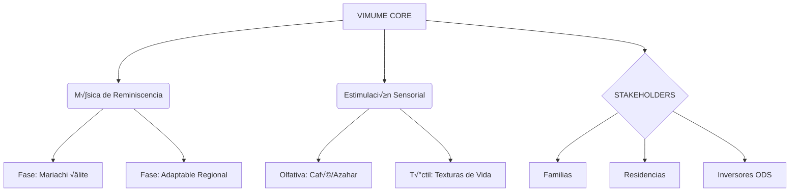

Ó# üé∂ VIMUME: ECOSISTEMA DE MEMORIA ADAPTABLE
## [2026] — Manual de Operaciones de Alto Impacto

> "La m√∫sica no es el fin, es el puente. El destino es la dignidad del recuerdo."

---

### 🗺️ MAPA VISUAL DEL PROYECTO

---

### 💎 CAPÍTULO 1: LA BRÚJULA (FRAGMENTO SMART)
| Concepto | Definición Estratégica | Valor para el SEO |
| :--- | :--- | :--- |
| **Propósito** | Honrar vidas mediante el sonido. | "Human-First Design" |
| **Misión** | Artesanía de momentos de conexión. | "Personalización Geriátrica" |
| **Diferenciador** | Metodología propia VIMUME. | "Propiedad Intelectual" |

> [!IMPORTANT]
> **BAÑO DE REALIDAD:** El Mariachi es tu "Caballo de Troya". Entras por la alegría del show y te quedas por la profundidad de la terapia. 

---

### 🛠️ PLAN DE IMPLEMENTACIÓN (Task List)
- [ ] **Email Bunker:** Crear `ayuda@viajemusicalporlamemoria.com`.
- [ ] **Blog Satélite:** Migrar el manual fragmentado a WordPress (Hostinger).
- [ ] **Lead Magnet:** Crear el "Test de Reminiscencia" en la Web React (Firebase).

---
*Generated by Antigravity OS for Edwin Agudelo*
Ó*cascade0823file:///H:/EAR/01_VIMUME/VIMUME_MASTER_DASHBOARD.md