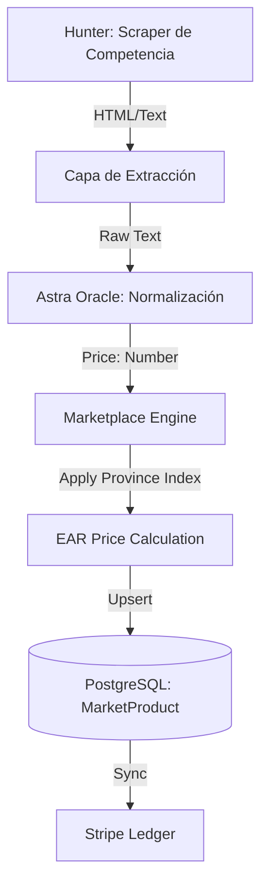

# 🧛 PROTOCOLO DE VAMPIRIZACIÓN POR PROVINCIA (V121)

Este documento detalla la lógica de dominio para el **Motor de Absorción de Precios** del EAR OS GOLD.

## 1. FLUJO DE EJECUCIÓN

## 2. COMPONENTES CLAVE

### A. Hunter-Collector (Predador)
Navega por las URLs de **Bodas.net** y otros competidores. Su misión es recolectar el "Ruido de Mercado".
- **Input**: URL de categoría (ej: Fotografía en Madrid).
- **Output**: Bloque de texto descriptivo del precio ("Desde 1.200€", "Precio medio 1500€").

### B. Astra Normalizer (Gemini 1.5)
Elimina el ruido publicitario y extrae el valor numérico puro.
- **Lógica**: Si detecta "Desde", toma el mínimo. Si detecta "Media", toma el valor. Si detecta "+ IVA", realiza la suma técnica.

### C. Province Index (Multiplicador de Zona)
EAR OS no opera en un vacío geográfico. Cada provincia tiene un `priceMultiplier` basado en el coste de vida y la demanda detectada:
- **Madrid (MADRID)**: x1.3
- **Barcelona (BARCELONA)**: x1.25
- **Albacete (ALBACETE)**: x0.9
- **Baleares (BALEARES)**: x1.3

### D. Algoritmo de Cálculo (EAR Price)
`EAR_Price = Market_Average * Province_Multiplier * S_Class_Margin`

## 3. DOMINANCIA GEOGRÁFICA (52 PROVINCIAS)
El sistema ha indexado las 52 provincias de España. Esto permite:
1.  **Arbitraje de Precios**: Detectar dónde los servicios están infravalorados.
2.  **SEO Quirúrgico**: Generar landing pages `/servicios/[nicho]/[provincia]` con precios reales y dinámicos.
3.  **Conversión B2B**: Ofrecer a los proveedores locales una comparativa real de su posicionamiento frente a la competencia.

## 4. ESTADO DE IMPLEMENTACIÓN
- [x] Esquema Prisma evolucionado.
- [x] Servicio `HunterCollector` instanciado.
- [x] Script de Seeding de Provincias creado.
- [x] Script de Seeding Masivo (5000+ registros) listo.

---
> **ESTRATEGIA S-CLASS**: "No competimos. Absorbemos, procesamos y dominamos."
